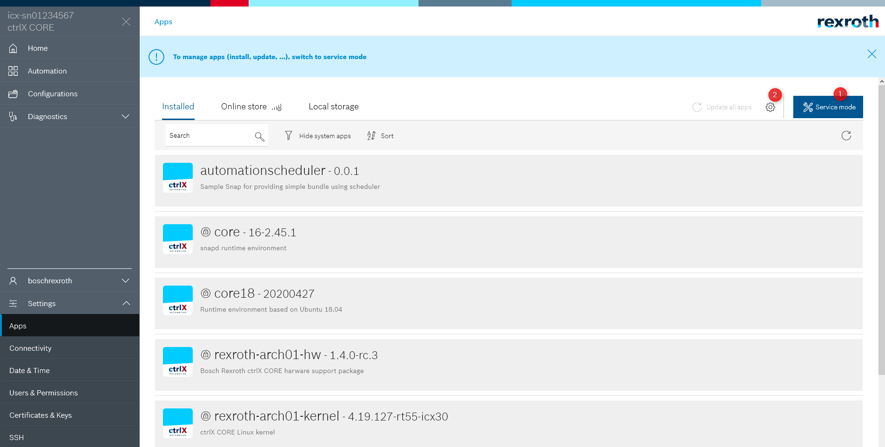
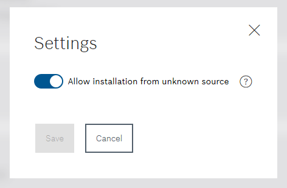

# Build and install

## Build program C++

To select the build target change the settings in Visual Studio status bar.

  

* Click on (1): Select __Release__ for creating a snap afterwards or __Debug__ when you can debug in Visual Studio Code.
* Select compiler kit: Click on (2) "No Kit Selected". Select
  * __"GCC for aarch64-linux-gnu..."__ for __ctrlX CORE__
  * __"GCC for x86_64_linux-gnu..."__ for __ctrlX CORE__ Virtual
* Build program. Click on (3) or press __F7__

### Create snap

Start task `CMake Build Snap` by selecting the following command of the menu bar in Visual Studio Code Editor:  
__Terminal > Run Build Task__  or press __Ctrl-P__ and enter __task CMake Build Snap__. Select the target for which you want to create the snap.

Now you should have one snap file generated:  
e.g `./helloworld_1.0.0_amd64.snap`

## Build program golang

### Create Snap

Start task `Snapcraft` by selecting the following command of the menu bar in Visual Studio Code Editor:  
__Terminal > Run Build Task__  or press __Ctrl-P__ and enter __task CMake Build Snap__. Select the target for which you want to create the snap.
Use `amd64` for __ctrlX COREvirtual__ and `arm64` for __ctrlX CORE__

Now you should have one snap file generated:  
e.g `./hello-webserver_1.0.0_amd64.snap`

# Install the snap

Open the web interface of your control. Switch to (1) __Service Mode__

 (2) and allow to install snaps from __untrusted source__ 
 
  

go to __Local Storage__ and install the file `*.snap` for the correct architecture. `*amd64.snap` for ctrlX CORE Virtual or `*arm64.snap` for ctrlX CORE.

In the examples, the apps are starting automatically as a daemon (line __daemon: simple__ in `snapcraft.yaml`).  