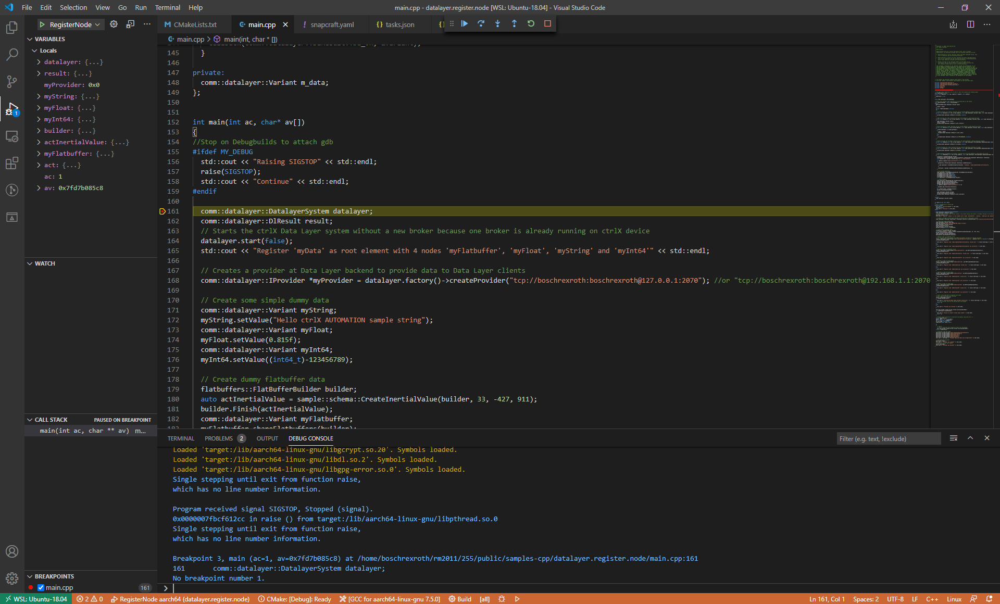

# Remote Debugging

## C++

### Introduction

It is just an experimental way for the operating system distributor. It's possible to run a snap application with `--experimental-gdbserver`. Due to this, you can attach a gdb to the process. 

### Prerequisites

* Snapd > 2.46.1
* Gdb-multiarch
* Root access to the device for ssh
* Debug snap
* Login via ssh using the keys (Login without password)

### Getting Started

1. Install the debug snap with the possibility to stop (necessary because gdb can only set breakpoints while the program stops)
2. Set up the IP of you target in the `launch.json` and `task.json`
3. Launch build task `Launch GDB-Server` or login you target with ssh and run the command (replace snapname and appname) `sudo snap run --experimental-gdbserver=:12345 <Snapname>.<Appname>` 
4. Use the right startup configuration
5. Remove the breakpoint witch is set by default `-exec delete 1`
6. Continue until you hit SIGSTOP
7. Set additional breakpoints and continue debugging

### Screenshots

