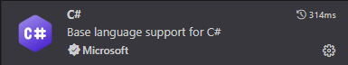

# README .NET Apps @ ctrlX

## Introduction

This document describes how to setup up your development environment for building __self-contained ctrlX Apps based on Microsoft .NET runtime__.

__Self-contained__ means, your App contains an already matching and optimized .NET runtime for your target architecture, so there's no need to install any additional .NET runtime.

All samples generate Apps (snaps) for the targets

+ ctrlX COREvirtual (amd64)
+ ctrlX CORE (arm64)

## Prerequisites

In this chapter we describe how to install the necessary components on a development environment based on a QEMU VM.

How you can create and run a QEMU VM is described [here](setup_qemu_ubuntu.md).

### Installation of .NET SDK on the QEMU VM

Start a SSH session and login into the VM with boschrexroth/boschrexroth:

      ssh -p 10022 boschrexroth@localhost

Start the script to install .NET as snap on your VM:

      ./install-dotnet-sdk.sh

When installation is finished you can check your installed SDKs:

      dotnet --list-sdks

The output should show the installed version and the path of ths dotnet-sdk.

Check your Runtime:

      dotnet --list-runtimes

### Install the Visual Studio Code Extension from Marketplace

We recommend to use __Microsoft Visual Studio Code__ on your host computer as IDE - [see here](vscode.md).

To develop and test .NET application for the ctrlX we have to install the C# extension in the VM.

* Start Visual Studio Code and connect it with the QEMU VM.
* Select the extension icon in the left side bar and enter c#
* Select this extension and click 'Install in SSH'

### Prepare NuGet on the QEMU VM

.NET projects can use NuGet packages. Therefor we have to provide some prerequisites on the VM.

If you're behing a corporate proxy, you have to configure the __NuGet Proxy__ in configuration file:

      /home/${USER}/.nuget/NuGet/NuGet.Config

Edit the NuGet configuration file with your preferred editor or with Visual Studio Code and add a _config_ section containing the __http_proxy__ and __https_proxy__ inside the _configuration_ section like shown below.

__Example:__

The following sample uses the [Px Proxy](https://pypi.org/project/px-proxy) running on the host computer. From the VM's point of view, this proxy can be reached with the URL http://10.0.2.2:3128.

      <configuration>
            <config>
                  <add key="http_proxy" value="http://10.0.2.2:3128" />
                  <add key="https_proxy" value="http://10.0.2.2:3128" />
            </config>
      ...
      </configuration>

## Building a .NET Sample Project
Each .NET sample provides a rich set of tasks for your convenience.

+ Click on Terminal -> __Run Task__.
+ Choose your preferred task to run.

### Build (compile) your code

+ Click on Terminal -> __Run Task__.
+ Choose Task __build__.

### Clean your code

+ Click on Terminal -> __Run Task__.
+ Choose Task __clean__.
  
### Publish your (self-contained) application 

+ Click on Terminal -> __Run Task__.
+ Choose any Task __publish *__ matching your architecture and mode.

### make snap

+ Click on Terminal -> __Run Task__.
+ Choose any Task __make snap *__ matching your architecture and mode.

## Debugging

### Debug on QEMU VM

Just press __F5__ or

+ Click on the __Run__ from the menu.
+ Choose Run -> __.NET Core Launch (console)__.
+ Press the green  __Play__ button.

### Debug snap on ctrlX COREvirtual

+ Click on Terminal -> __Run Task__.
+ Choose any Task __make snap amd64__.
+ Install snap on ctrlX COREvirtual via ctrlX web interface
+ For debugging snaps see [here](https://snapcraft.io/docs/debug-snaps)

### Debug snap on ctrlX CORE

+ Click on Terminal -> __Run Task__.
+ Choose any Task __make snap arm64__.
+ Install snap on ctrlX CORE via ctrlX web interface
+ For debugging snaps see [here](https://snapcraft.io/docs/debug-snaps)

Now you're ready to code .NET on ctrlX! 

## Best Practise

### Provider Concepts

There different concepts to write a ctrlX Data Layer provider:

#### Create and register nodes with individual node handlers

Create a provider, which creates and registers _all_ nodes with an _individual_ node handler 

            n x CreateNode
            n x Register
            Node : Handler = 1:1

__Recommendation:__

+ Use for a _small/medium_ of nodes with _individual_ node handling.
+ Use for a logical grouping and managing of nodes.

__Pros:__

+ The ctrlX Data Layer is managaging your node hierarchy: No implementation of _OnBrowse()_ required (return DL_UNSUPPORTED or DL_OK with an empty list).

__Contras:__

+ Not efficent for a large/very large set of nodes to handle.

__Samples:__

+ datalayer.provider

#### Create and register nodes with same node handler

Create a provider, which creates _individual_ nodes and registers all nodes individually with _same_ node handler.

            n x CreateNode
            n x Register
            Node : Handler = n:1

__Recommendation:__

+ Use for a _small/medium_ of nodes with _common_ node handling
+ Use for a logical grouping and managing of nodes.

__Pros:__

+ The ctrlX Data Layer is managaging your node hierarchy: No Implementation of _OnBrowse()_ required (return DL_UNSUPPORTED or DL_OK with an empty list).

__Contras:__

+ Not efficent for a large/very large set of nodes to handle.

__Samples:__

+ datalayer.provider.alldata

#### Virtual provider (lightweight): Register on wildcard and manage virtual nodes

Create just _one_ node with a single node handler, registered to a _wildcard_ address  (e.g. myroot/**) and managing the nodes for your own. This _lightweight_ handler returns _virtual_ nodes in _OnBrowse()_ method. 
See ctrlX Data Layer documentation for details.

            1 x CreateNode
            1 x Register
            Node : Handler = n:1

__Recommendation:__

+ Use for a _large/very large_ or _dynamic_ set of nodes (big data provider).
+ Use if you want to manage the nodes in your application code.

__Pros:__

+ Very efficient.

__Contras:__

+ The ctrlX Data Layer is _not_ managaging your node hierarchy: You have to return the valid data in _OnBrowse()_.

__Samples:__

+ datalayer.provider.virtual

## Pitfalls

### Arithmetic operators of different integral or foating point types

The following operators perform arithmetic operations with operands of numeric types:

+ __Unary__: ++ (increment), -- (decrement), + (plus), and - (minus) operators
+ __Binary__: * (multiplication), / (division), % (remainder), + (addition), and - (subtraction) operators

Those operators are supported by all integral and floating-point numeric types.

In the case of integral types, those operators (except the ++ and -- operators) are defined for the __int__, __uint__, __long__, and __ulong__ types. 

When operands are of other integral types (__sbyte__, __byte__, __short__, __ushort__, or __char__), their values are __converted to the int type__, which is also the __result type__ of an operation. 

When operands are of __different integral or floating-point__ types, their values are __converted to the closest containing type__, if such a type exists. For more information, see the Numeric promotions section of the C# language specification. 

The ++ and -- operators are defined for all integral and floating-point numeric types and the char type.

__Example__:

Let' say we just wan't to increment a __sbyte__ Variant value by keeping the data type, we have cast the result after performing the arithmetic operation:

      sbyte value = 42;
      var oldVariant = new Variant(value)
      var newVariant = new Variant((sbyte)(oldVariant.ToSByte() + 1));

+ Please see [here](https://docs.microsoft.com/en-us/dotnet/csharp/language-reference/operators/arithmetic-operators) for more informations.

## Support

### Developer Community

Please join the [Developer Community](https://developer.community.boschrexroth.com/)

### SDK Forum

Please visit the [SDK Forum](https://developer.community.boschrexroth.com/t5/ctrlX-AUTOMATION/ct-p/dcdev_community-bunit-dcae/)

### Issues

If you've found an error in these sample, please [file an issue](https://github.com/boschrexroth)

## License

SPDX-FileCopyrightText: Bosch Rexroth AG
SPDX-License-Identifier: MIT