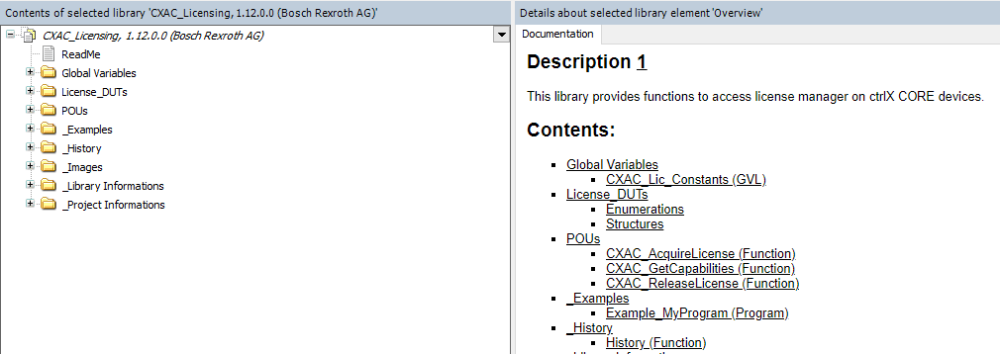

This document is part of the Bosch Rexroth ctrlX CORE App Development Guideline, and describes how to adapt to the the license management of the device.

Please refer to the App Development Guide for further information.

### **Table of Contents**

[1 Introduction](#introduction)

[2 License Enforcement](#enforcement)
> [2.1 Add Content Plug to snapcraft.yaml](#plug)

> [2.2 Adapt package-manifest.json](#manifest)

> [2.3 Use REST API to Enforce Licenses](#rest)

> [2.4 Access License Manager in PLC Application](#plc)

> [2.5 License Management in Windows Applications](#windows)

[3 Licensing Modes ](#modes)

> [3.1 Overview](#overview)

> [3.2 ctrlX CORE Main License](#main)

> [3.3 ctrlX CORE Temporary Usage Rights (Emergency Mode)](#emergency)

> [3.4 ctrlX CORE 10 Day Trial License](#trial)

> [3.5 Four Hour Engineering Demo License on  ctrlX CORE<sup>virtual</sup>](#virtual)

> [3.6 Additional License Mode: ctrX CORE 3 Month Test License](#test)

> [3.7 Spoofing detection by optionally signing / verifying license requests](#spoofing)

# 1 Introduction <a name="introduction"></a>

From a user's perspective, device licenses are managed by the Bosch Rexroth Licensing Center [https://licensing.boschrexroth.com](https://licensing.boschrexroth.com).

Using the portal it is possible to assign licenses to a device and to download a capability response, which contains all assigned licenses for a specific device. The downloaded capability response can than be deployed to the corresponding device.

The ctrlX CORE User Interfaces therefore provides a page which allows to upload a capability response and to check the currently available licenses on the device. For developers, the ctrlX CORE offers a restful API via an internal unix domain socket which can be used by an app to request and release a specific license.

# 2 License Enforcement <a name="enforcement"></a>

To integrate an app into the license management, please follow the instructions below.

## 2.1 Add Content Plug to snapcraft.yaml (<a name="plug"></a>)
To get access to the unix domain socket that provides the restful API, add the following content plug definition to the snapcraft.yaml:

```yaml
plugs:
  licensing-service:
    interface: content
    content: licensing-service
    target: $SNAP_DATA/licensing-service
```

This will create a folder "license-service" during installation of the app on the ctrlX CORE and provide access to the unix domain socket "licensing-service.sock" which will be located in the folder.

## 2.2 Adapt package-manifest.json <a name="manifest"></a>

The app shall provide information in the package-manifest about each license that is supported. Description and title shall be human readable.
The "required" flag indicates whether a license is mandatory to use the application. Set the flag to true when the license is required and to false, when the license is optional. Multiple licenses can have the "required" flag set to true simultaneously. In this case, the app must ensure that it works if any of the 'required' licenses is available.

  ```json
   "licenses": [
      {
        "name": "SWL-XC*-RUN-DLACCESSNRT**-NNNN",
        "title": "ctrlX OS License - Customer App",
        "description": "Integration of customer apps into ctrlX OS with access to the ctrlX Data Layer",
        "required": true
      }     
    ],
```

## 2.3 Use REST API to enforce licenses <a name="rest"></a>


### 2.3.1 License Integration

How an app reacts when no license is present or the license is removed during runtime, can be freely chosen by the app. Nevertheless, to provide a unique user experience across multiple apps, the following best practices are recommended.

The app should acquire the license when started or (each time) when a function is called which requires a license. Additionally, the app should check whether the license is still present on the device in regular intervals or if the license has been removed or expired. Therefore, either release and re-acquire the license or use the getCapabilities() function. This applies for both, mandatory and optional, types of licenses.

In case a license is not required anymore - e.g. when the app is stopped or uninstalled - the license should be released so that it is returned to the license pool and can be acquired by another app. Otherwise, the license will become available again only after a reboot of the device.

In case a license is missing, a warning or an error shall be displayed and/or logged and the user should be informed which licences are required to execute the specific functionality of the app.


!!! important
    On the ctrlX CORE, when enforcing licenses the use of the license management is mandatory. Individual implementations are not permitted.


### 2.3.2 License Manager API

The licensing API is available on GitHub: [https://boschrexroth.github.io/rest-api-description](https://boschrexroth.github.io/rest-api-description)

Implementing this API, an app is able to
- Acquire a license
- Release a license
- Get a list of all available license capabilities
- Update the license status in a ctrlX CORE by uploaded a license file


| Function | HTTP Method | URI | Payload | Parameters | Response |
|---|---|---|---|---|---|
| Aquire license	| POST |/license| {<br>"name": "SWL-XCx-FRW-BASIC_FOOBAR-NNNN",<br>  "version": "1.0" <br>} |signResponse | 200<br>{<br>  "isPermanent": true,<br>  "endDate": "2030-01-01T12:00:27.<br>7+00:20",<br>  "name": "SWL-XCx-FRW-BASIC_FOOBAR-NNNN",<br>  "id": <br>0083d875-30e8-4ff6-9f92-46096ef2d123",<br>  "version": "1.0",<br>  "startDate":"2030-01-01T12:00:27.87+00:20"<br>} |
|Release license|	DELETE|	/license/{id}	|none |none |	204	|
|Get list of all activated capabilities	|GET|	/capabilities	|none | none |200,<br>[<br>{<br>"isPermanent": true,<br>    "finalExpirationDate": "2030-01-01T12:00:27.87+00:20",<br>    "name": "SWL-XCx-FRW-BASIC_FOOBAR-NNNN",<br>    "count": 1,<br>    "version": "1.0",<br>    "startDate": "2030-01-01T12:00:27.87+00:20"<br>  }<br>]<br>
| Update the capability state in the device| PUT| /capabilities | file<br>string($binary) | withChangeReport| 200
|Get the device certificate chain |GET|	/device-certificate-chain |none | none |200,<br> -----BEGIN CERTIFICATE----- MIIDOTCCA+gAwIBAgIURF1DTLBM3YljOsMxXMtHvtEVzE4wCgYIKoZIzj0EAwIwgbgxCzAJBgNVBAYTAkRFMRAwDgYDVQQIDAdCYXZhcmlhMRUwEwYDVQQHDAxMb2hy...<br>FgYDVR0lAQHBAwwCgYIKwYBBQUHAwIwCgYIKoZIzj0EAwIDSAAwRQIgH9Ksvn024lHfDhL4w4YyBLAf6JzxjBix8L6Ka1m3NUgCIQCx3sd85Ag0m/XuF+GViRiL3obO2Kr7reeXVEAg1gRgqw== <br> -----END CERTIFICATE----- <br> -----BEGIN CERTIFICATE----- MIIDOjCCAt+gAwIBAgIUUdrEfPLcIibj5PCsmD1K6nYK0wCgYIKoZIzj0EAwIw...kRi49k6qak0EzsDVCWPxXeTLEa9OwinaCm1AiEAia+Kfhmg3cFI6KKHCA12ceic 0QRmvnOTubiVvXuTy88=QUHAwIwCgYIKoZIzj0EAwIDSAAwRQIgH9Ksvn024lHfDhL4w4YyBLAf6JzxjBix8L6IDSAAwRQIgH9Ksvn024lHfDhL4w4YyBLAf6JzxjBix8L6<br>-----END CERTIFICATE----- <br>

### 2.3.3 Acquiring & releasing a license

Acquiring a license generates a unique license ID for that particular license.


> 

This ID is required to release the license. Therefore, this ID should be stored in a directory which is not affected when your application goes into a faulty state and needs to be restarted. The usage of /tmp is recommended for this.


### 2.3.4 Available licenses on the device (activated capabilities)
Upon request, an app may retrieve the list of available licenses on the device including all details (e.g. expiration, counter, ...). This may be used to check whether a specific license is available (and not in use) before trying to acquire it.
Nevertheless, this is optional - it is sufficient to just try to acquire a license and then check whether the acquisition request was successful.

Sample response:

> 

### 2.3.5 Update license status
The API allows to upload a capability response (license file) from the license portal to update the license status on the device (e.g. add new licenses). This functionality is not required by an app itself but is rather performed by the device operator depending on which licenses will be required according to the installed apps. The REST API route to upload a license file allows passing an optional query parameter (withChangeReport). If this parameter is set, the result of the API will return all licenses that have been added / removed by the used license file.

## 2.4 Access License Manager in PLC Application <a name="plc"></a>

### 2.4.1 ctrlX AUTOMATION Library *CXA_LICENSING*

In addition to the REST API, the License Manager can also be used in a PLC application.
To use the according functions, the library *CXA_LICENSING* can be added to a PLC application in the Library Manager.

Please refer to the ctrlX PLC Engineering documentation for information about the Library Manager.

### 2.4.2 Supported functions

The *CXA_LICENSING* library provides POUs to acquire and release licenses and to get capabilities. In addition, the library also comes with an example how to use the licensing mechanisms in a PLC application.

The online documentation of the library in ctrlX PLC Engineering provides detailed information about the POUs and the example:
> 

## 2.5 License Management in Windows Applications <a name ="windows"></a>

ctrlX WORKS also supports the License Manager.

Please find the ctrlX WORKS Licensing API here in the ctrlX World Portal:
[ctrlX WORKS Licensing API](
https://bosch.sharepoint.com/sites/msteams_1647245/Shared%20Documents/Forms/AllItems.aspx?id=%2Fsites%2Fmsteams%5F1647245%2FShared%20Documents%2FPartner%2F01%5FctrlX%2DWorld%5Fgeneral%5Finformation%2F03%5FApp%5FDevelopment%2FWindows%5Flicensing%2Fcom%2Eboschrexroth%2Ectrlxworks%2Elicensing%2Eapi%2D1%2E0%2E0%2Ezip&parent=%2Fsites%2Fmsteams%5F1647245%2FShared%20Documents%2FPartner%2F01%5FctrlX%2DWorld%5Fgeneral%5Finformation%2F03%5FApp%5FDevelopment%2FWindows%5Flicensing)

This API provides licensing functions for Windows Applications, and comes with according samples for different programming languages and frameworks.

# 3 Licensing Modes  <a name="modes"></a>

## 3.1 Overview <a name="overview"></a>
The license management on the **ctrlX CORE** supports several different licensing modes. The following table gives an overview about the license modes.

| License Mode | Target | Key | Usage | Additional information |
|---|---|---|---|---|
| Main License | ctrlX CORE |`SWL_XCR_{YOUR_APP_LICENSE_CODE}` | mandatory |(none specific)
| ctrlX OS Host Runtime License | ctrlX CORE | `SWL-XOH-RUN-xxxxxxxxxxxxx-NNNN` | mandatory |Required for ctrlX OS devices. This license is pre-installed on Bosch Rexroth devices.
| Temporary Usage Rights (Emergency Mode) | ctrlX CORE |`SWL_XCR_{YOUR_APP_LICENSE_CODE}` | mandatory |`tampered` flag is `true` |
| 10 Day Trial License |ctrlX CORE |`SWL_XCR_{YOUR_APP_LICENSE_CODE}` | optional |`isPermanent` flag is `false`
|Four Hour Engineering Demo License |ctrlX CORE<sup>virtual</sup>|`SWL_XCR_ENGINEERING_4H`|optional|(none specific)

As displayed in the table, there is only the "four hour engineering demo license" available on the **ctrlX CORE<sup>virtual</sup>**, which allows to evaluate a new app for a limited time (the trlX CORE<sup>virtual</sup> is terminated after four hours to prevent productive use)

The different license modes, and the expected behaviour of the App for these modes, are briefly described below.

## 3.2 ctrlX CORE Main License  <a name="main"></a>

**Purpose:** Standard License

**Description:**

- This is the standard license that a user obtains when buying an app. Therefore, the support of this license mode is **mandatory**.
- The license is obtained (bought) in the Bosch Rexroth Licensing Center and then assigned to a specific device by the user.
- The standard license can be either permanent (unlimited) or time based (expires)

**Expected App Behaviour**:

- The app shall start and run as intended, when the standard license is available.
- If acquiring a license is not possible (no license is available), the app shall inform the user that a license needs to be obtained.
- In case of time based licenses, the app should inform the user on time before the license expires. As a best practice, a user should be informed
four weeks prior to expiration.
- When no standard app specific license is available on the device, an app shall only run if one of the other licenses is active.


## 3.3 ctrlX CORE Temporary Usage Rights (Emergency Mode)  <a name="emergency"></a>

**Purpose:** Avoid machine downtime

**Description:**

- On a ctrlX CORE, the user  has the possibility to activate a special mode that is called "Temporary usage rights". The mode can be activated using the License Manager UI.
- Enabling this mode allows users to operate the ctrlX CORE in a productive environment for ten consecutive days. The single purpose of this mode is to prevent a downtime when a defect device is replaced and no licenses have been assigned, yet. ==**This mode can only be activated once on a device**==
- Within these ten days, the user has to either add licenses to the new device or move the licenses from the broken device to the replacement device.

!!! warning
    After ten days, the mode will expire and cannot be reactivated.

**Expected App Behaviour:**

 - Support of this license is **mandatory**.
 - The app is able to detect whether the system runs in this mode by evaluating the `tampered` flag in the response to the acquisition request (the flag is set to `true`)
 - When this mode is active, the app should work as if a standard license is available.

## 3.4 ctrlX CORE 10 Day Trial License  <a name="trial"></a>

**Purpose:** Test Mode on ctrlX CORE Hardware

**Description:**

- The 10 day trial license allows to use all apps - which support this license mode - for a restricted time for testing purposes.
- The license is intended for test and evaluation only and not for use in a production environment
- The license will automatically expire after 10 days.
- Other than the temporary usage rights mode, 10 day trial licenses may be used (consecutively) in case an according contractual agreement is available for all involved parties (Bosch Rexroth, Customer, ctrlX World Partner).

**Expected App Behaviour:**
- Support of this mode is **optional**.
- The app is able to detect whether the system runs in this mode by evaluating the `isPermanent` flag in the response to the acquisition request (the flag is set to `false`)
 - When this mode is active, the app should work as if a standard license is available.


## 3.5 Four Hour Engineering Demo License on  ctrlX CORE<sup>virtual</sup> <a name="virtual"></a>

**Purpose**: Evaluation mode on a ctrlX CORE<sup>virtual</sup>
**Description**:
-  An according special license key (`SWL_XCR_ENGINEERING_4H`) indicates that currently the limited evaluation mode is active
- After 4 hours the ctrlX CORE<sup>virtual</sup> shuts down itself to prevent a productive use.

**Expected App Behaviour:**
- Support of this mode is **optional**.
- In order to support this non-productive mode, apps must check for the license `SWL_XCR_ENGINEERING_4H`, which guarantees that the runtime is limited to 4 hours.

##  3.6 Additional License Mode: ctrX CORE 3 Month Test License  <a name="test"></a>
**Purpose:** Time limited test and evaluation of apps which are in beta/prototype phase (B-Sample phase)

**Description:**

- This mode is not intended / available for partner apps by default.
- Please get in touch with Bosch Rexroth directly, if this mode might be of interest for you.

##  3.7 Spoofing detection by optionally signing / verifying license requests  <a name="spoofing"></a>
**Purpose:** This mechanism allows applications that request a licene to verify that the license indeed comes from the ctrlX OS license manager.

**Description:**
- Although it is quite unprobable, that a malicious actor could replace ctrlX OS' license manager, a further layer of security is added
- Applications can request licenses (see [License Manager API](#232-license-manager-api)) and set the 'signResponse' query parameter
- Once a license has been requested (with the corresponding query parameter set) the response's header will contain a signature
- This signature was calculated using the device certificate (and the corresponding tpm-based key) and can be used to fully verify that the license response was indeed from a certified ctrlX OS device with no spoofed license manager

**Usage:**
1) Any application that wants to use this mechanism will need to send a license request with the corresponding query parameter set <br>
    1.1) The response header contains a hex-encoded signature ("Payload-Signature") <br>
    2.2) The signature is created using ECDSA-SHA256 on the standardized curve 'SECP-256' <br>
2) Once the response (and the signature in 'Payload-Signature') the application needs to verify that the signature is indeed valid and was produced by the device <br>
2.1) The license manager's device certificate chain (and the public key herein) can be used for this - see (see [License Manager API](#232-license-manager-api)) <br>
2.2) Use the public key inside the end-entity (device) certificate to verify the signature <br>
3) Once signature verification is successful, we can assume that the chain sent by the device and the key used for signing correspond, however additional steps are required to ensure that the device is indeed a ctrlX OS device (and the license manager is unspoofed) <br>
3.1) The device-certificate chain as retrieved in step 2.1 can now be used to check whether the device is a ctrlX OS device by verifying the certificate chain <br>
3.2) The application now needs to verify that the certificate was indeed signed by an authorized ctrlX OS party (and its root CA certificate) <br>
3.3) For this purpose it needs to know the corresponding ctrlX root CA certificate (com.ctrlx-automation.os.crt) - recommendation is to have it inside the app's binaries as this will ensure that no malicious entity would be able to change it. <br>
3.4) Verify the certificate chain from the device up to the mentioned root certificate <br>

**Note:**
As there are multiple steps involved here (where some of them might be time consuming due to cryptographic complexity) it is the app's responsibility whether it wants to check this once during startup, according to a defined interval, etc. Please note the genereal perception is that - if this feature is required - checking it during startup suffices to verify the integrity of the license manager.

**ctrlX OS root CA certificate:**
As stated in in step 3.2, the application needs to know the ctrlX OS root CA certificate (com.ctrlx-automation.os.crt). If this feature is required, the corresponding certificate needs to be embedded inside the application. The ctrlX OS root CA certificate can be retrieved via the following link: <br>

[Download ctrlX OS root CA certificate (com.ctrlx-automation.os.crt)](certificates/com.ctrlx-automation.os.crt)

**Copyright**

SPDX-FileCopyrightText: Bosch Rexroth AG
