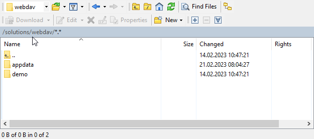

**Copyright**
© Bosch Rexroth AG 2024
This document, as well as the data, specifications and other information set forth in it, are the exclusive property of Bosch Rexroth AG. It may not be reproduced or given to third parties without our consent.

**Liability** The information in this document is intended for product description purposes only and shall not be deemed to be a guaranteed characteristic, unless expressly stipulated by contract. All rights are reserved with respect to the content of this documentation and the availability of the product.

### **Table of content**

[1 Introduction](#introduction)

[2 Get access to the Solutions storage](#access)

[3 Specify your app directories](#specify)

[4 Register for saving and loading](#register)

[5 Implement saving and loading](#implement)

[Appendix](#appendix)

## 1 Introduction<a name="introduction"></a>

This document shows how to integrate an app into the common ctrlX persistence and storage mechanisms.
Persistence handling is done by the Solutions app (app.solutions), which is an essential part of any ctrlX CORE device. It provides a central storage for other apps that need to persist their app data. App data is saved to the storage or loaded from the storage on demand (via app editors, the "Manage app data" UI, or the Solutions REST API).


The diagram shows that the storage provided by the Solutions app is structured into two conceptual locations:

- The appdata location contains the files representing the current state of the apps and is owned by the apps.
- The archive contains saved configurations and is managed by the Solutions app.

The responsibilities of the Solutions app and Apps that persist their data in the Solutions storage are allocated as follows:

**Solutions (app.solutions):**

- Provide file storage and make appdata directory available via the activeConfiguration symlink
- Trigger and coordinate "save" and "load" operations and collect results
- Manage the archived configurations (Web UI, REST API)

**Apps:**

- Participate in loading and saving
- Use and update the files in their appdata directories
- Must not change the contents of archived configurations

## 2 Get access to the Solutions storage<a name="access"></a>

The Solutions app exports the base directory of the storage location as a slot using a content interface. Your app must provide a plug that connects to the slot so that the $SNAP_COMMON/solutions directory becomes visible in your file system:

**snapcraft.yaml:**

```yaml
plugs:
  active-solution:
    interface: content
    content: solutions
    target: $SNAP_COMMON/solutions
```

The `$SNAP_COMMON/solution` directory contains an `activeConfiguration` symlink. Use this symlink to get the path to the appdata directory which contains the currently active app data: `$SNAP_COMMON/solutions/activeConfiguration` → `$SNAP_COMMON/solutions/DefaultSolution/configurations/appdata/`

**Note:**

Your app might start before the **active-solution** interface is connected by the system. You can handle this scenario in two ways:

- Use an entry-point script and check status of the **active-solution** interface using snapctl is-connected active-solution; e.g. create a script which has the following content and is defined in your snapcraft.yaml as the command to execute:

```bash
  #!/bin/bash

    while ! snapctl is-connected active-solution
    do
        sleep 5
    done

    $SNAP/bin/<your executable>
```

- Check existence of the folder `$SNAP_COMMON/solutions/activeConfiguration` in your application logic

In a development environment, you can check the connection of the **active-solution interface** by

- calling *snap connections* and checking whether there is an entry with **interface content[solutions]** for the **plug \<your app name\>:active-solution** and **slot rexroth-solutions:active-solution**
- running a shell in the context of your app and checking the content of the folder `$SNAP_COMMON/solutions` which must contain a folder **DefaultSolution** and the two symlinks **activeSolution** and **activeConfiguration**. The shell can be started with *snap run --shell \<your app name\>.\<your app command\>*

## 3 Specify your app directories<a name="specify"></a>

Within the appdata root directory, define a subdirectory with a unique name as your base directory. We recommend to use your app's name in lowercase letters to avoid conflicts with other apps and allow users to easily identify your data in the file system. The screenshot shows an example with the base directories of the Motion and PLC apps, among others.


You should also explicitly declare ownership of your app directories in your package manifest. The following example shows the declaration of the PLC base directory.

**package-manifest.json:**

```json
"configuration": {
  "appDirectories": [
    {
      "name": "plc",
      "description": "PLC",
      "icon": "bosch-ic-components",
      "copyOnLoad": true
    }
  ]
}
```

- **name** (required): The name or path of the app directory

- **description**: The title to display in the "Manage app data" content view (should be consistent with title used e.g. in sidebar menu); if omitted or empty, the app directory does not appear in the content view

- **icon**: The app icon to display in the "Manage app data" content view (should be consistent with icon used e.g. in sidebar menu); if omitted or empty, no icon is displayed in the content view

- **copyOnLoad** (default: *false*): Set *true* to instruct the Solutions app to copy the data from your app directory
in the archive to the active configuration on load; omit (or set *false*) to enable custom "smart loading"; see section
"From copying to smart loading" for details

  > Since XCR-V-0120, app directories with active copyOnLoad are only copied if the corresponding app is installed
  > and enabled on loading.

- **writeProtected** (default: *true*): App directories and their contents in the active configuration are protected
against changes through the WebDAV interface and the Solutions UI by default. Set *false* to allow changes for a
directory and its subdirectories, which requires that your app can detect and handle potential changes appropriately.
Since XCR-V-0112.

  > Since XCR-V-0120, the default value of the writeProtected attribute is *true* in order to protect app directories
  > against unintended changes.

Configuration contents should generally have the following properties:

- **Compatible**: Changes to content formats should not break existing applications (new format definitions accept old contents).
- **Human-readable**: Formats should be human-readable and therefore be text-based (which also allows comparisons between different versions). Names and values should be descriptive and understandable, e.g. by using well-known domain vocabulary.
- **Extendable**: Device and engineering functionality will enhance from version to version. You should make sure that your file formats are extendible to cope with new use cases.

We recommend JSON as the file format where possible, as it supports these properties. You may also consider to provide corresponding JSON-schema files to enable guidance and validation. In any case, JSON files should contain a root object (NOT an array) to enable schema references and extendibility.

!!! Note
    An app may specify "private files" inside its appdata directories in order to exclude them from save and load operations. See appendix "App-private files" for details.

## 4 Register for saving and loading<a name="register"></a>

In order to participate in the save and load operations triggered by the Solutions app, your app must register its own save and load commands. The following example shows how to register a save and a load command for Motion settings by adding the respective command declarations to the package manifest:

**package-manifest.json:**

```json
"commands": {
  "activeConfiguration": {
    "save": [
      {
        "id": "motion",
        "subject": "motion settings",
        "url": "/automation/api/v1/motion/admin/cfg/save"
      }
    ],
    "load": [
      {
        "id": "motion",
        "subject": "motion settings",
        "url": "/automation/api/v1/motion/admin/cfg/load"
      }
    ],
  }
}
```

For each command, the following elements must be specified:

- **id** (required): a string serving as the identifier of the save or load command; must be unique within the “commands/activeConfiguration/save” and “commands/activeConfiguration/load” paths, respectively
- **subject** (required): a string denoting what will be saved or loaded; used to inform users, e.g. in messages like “Loading *motion settings*” or “Failed to load *motion settings*”
- **url** (required): a string representing the request URL; URLs starting with a slash are interpreted to be relative to `https://localhost`. The URL is used for HTTP POST requests which include command parameters in the request body (see section "Request parameters" for details)

By default there is no defined order of command execution. Starting with version XCR-V-0112, a command may declare that it needs to be executed **after** other commands. If this is required (which should be the exception), add an after element to your command declaration with an array containing the IDs of the predecessor commands.

>**Hint for developers providing ctrlX Data Layer endpoints for loading and saving**
>
>In order to make the ctrlX Data Layer endpoints for saving and loading a configuration consistent, the respective URLs should adhere to the following pattern:
>
>\<datalayer-basepath\>/\<**technology**\>/admin/cfg/\<operation\>
>
>Examples:
>
> - /automation/api/v1/**scheduler**/admin/cfg/save(or load)
> - /automation/api/v1/**fieldbuses/ethercat/master**/admin/cfg/save (or load)
> - /automation/api/v1/**motion**/admin/cfg/save (or load)

## 5 Implement saving and loading<a name="implement"></a>

With the term "participants" we refer to apps that have registered save and load commands in order to participate in save and load operations as described in the previous section.

### Processing sequences

Save and load operations triggered by the Solutions app are processed in phases. In each phase, the Solutions app sends requests to all registered participants sequentially in undefined order; that is, participants must not depend on each other.

A **save operation** is processed in one phase:

1. **save**: Save current app state into active configuration (appdata directory)

A **load operation** is processed in five phases:

1. **query**: Check if loading is possible in the current system state
2. **prepare**: Perform any required preparatory steps
3. **load**: Load archived configuration into the apps, and persist resulting app state to the active configuration (appdata directory)
4. **validate**: Perform any required post-processing steps
5. **activate** (if phases 1-4 have been finished without problems): Establish desired run state of the device; **abort** (otherwise): Do not change run state of the device

If the query phase (1) has been completed without any error or problem response, the processing continues with the following phases (2-5) in the specified order. Otherwise, the load operation is canceled and the errors and problems are reported to the user.

Any errors or problems that occur during phases 2-5 are collected and reported to the user when the whole operation is completed.

A more detailed description of the load phases and example sequences can be found in the Appendix.

> **Note:** Starting with XCR-V-0120, a save operation is triggered when a load operation is completed. This ensures that
> the content of the active configuration (appdata directory) is consistent with the data that is active in the apps.
>
> The save requests of this special save operation have the same id as the preceding load requests. Participants may
> ignore those save requests if they update their app data on loading.

### Request parameters

The following information is sent as request parameters to all participants in all save and load phases:

- **configurationPath**: the directory of the configuration to be loaded, starting from the solutions directory, e.g. "solutions/DefaultSolution/configurations/`<configuration>`"; in case of a save operation, the configuration path should be ignored, as the target of saving is always the active configuration (appdata directory)
- **id**: a random code which identifies the instance of save or load operation, e.g. "282xy5"; also used to find corresponding messages in the Logbook; should be included in the dynamic description of diagnostic messages and trace messages by all participants; convention: put in square brackets at the end of diagnostic messages and trace messages; see section "Diagnostic messages" for details
- **phase**: specifies the current processing phase of a save or load operation; one of the phases described in section "Processing sequences"; e.g., "load"

The request parameters are provided in the request body as a JSON object with the following structure (using the sample values from above):

```json
{
    "configurationPath": "solutions/DefaultSolution/configurations/<configuration>",
    "id": "282xy5",
    "phase": "load"
}

```

### Expected behavior

Participants must consider the following conditions and constraints in their command implementations.

> **Asynchronous command implementations (since XCR-V-0304)**
> 
> Long-running operations (more than one minute) have to be implemented as asynchronous commands.
>
> Asynchronous command implementations must respond with a status code 201 and a Location header containing a resource path. The Solutions app then uses the resource path to poll the state of the command execution. The response body is expected to be a JSON object with the following content:
> ```json
> {
>   "state": "running", // one of "pending", "running", "done", or "failed"
>   "result": {} // optional; must contain problem object if state "failed"
>}
>```


#### Success behavior

- Synchronous implementations of save or load commands must respond with a success status code (2xx or 3xx), typically with 204 and an empty body.

- Asynchronous implementations of save or load commands must respond as specified above with the state "done" after completion.

- If there is no data to load, the command must reset its app to its initial state (no axes defined, no PLC program available, etc.). Related app data must completely be removed from the active configuration.

- If a phase is not relevant or unknown to the command, the command must respond with the status code 204 (and an empty body).

#### Failure behavior

- Synchronous implementations of save or load commands must respond with an error status code (4xx or 5xx). The response body must contain a JSON object describing the occurred problem (see "Problem Schema Definition" in the Appendix for the required format).

- Asynchronous implementations of save or load commands must respond as specified above with the state "failed" and a result describing the occurred problem (see "Problem Schema Definition" in the Appendix for the required format).

- The Solutions frontend reports the following fields of the problem response for every failed save or load command:
  - mainDiagnosisCode and title
  - detailedDiagnosisCode and detail
  - dynamicDescription incl. the id of the save or load operation (see example below)

The dynamicDescription field can provide specific information for the user, like the cause of the failure and hints how to resolve it (if cause and hint are not already provided through the main and detailed diagnosis).
The field may contain “\n“ to separate cause and hint in the result output of the UI, e.g. “Format error in X.json.\nAdapt file or use motion editor to fix/recreate axis. [282xy5]”

> **Common response if apps require Setup state for loading (since XCR-V-0116)**
>
> If participants require Setup state for loading, they should in the query phase
>
> - Respond with status code 409 (Conflict)
> - Return a Problem object with the common mainDiagnosisCode **080F0E00** ("Loading configuration not possible in current state")
> - Not write diagnoses to the Logbook

#### Diagnostic messages

The Solutions app only logs a general diagnostic message on start and finish of a save and load operation. Each participant should additionally log its own activities and occurred problems into the device’s Logbook. Any diagnostic message or trace message related to saving or loading should include the current id at the end of the dynamic description in square brackets.

Example of diagnostic entries as they would appear in the Logbook:

| Level | Date | Unit | Code | Description |
| --- | --- | --- | --- | ---|
| Info | 06/04/2020, 10:33:11.964 | web.solutions | 080A0401 | Loading configuration successfully finished [282xy5] |
| ... | ... | ... | ... |... |
| ... | ... | ... | \<main diag code\><br>\<detailed diag code\> | \<main diag text\><br>\<detailed diag text\><br>\<dynamic description text\> [282xy5]<br>\<entity text\> |
| Info | 06/04/2020, 10:31:20.733 | web.automation | \<main diag code\> |Trace message\<component name\><br>Scheduler successfully prepared for loading [282xy5] |
| Info| 06/04/2020, 10:31:19.820| web.solutions| 080A0400 | Loading configuration started [282xy5]|

> **Note:**
> The id of a save or load operation can also be found on and copied from the "Manage app data" page (Save or Load report) in order to search for corresponding messages in the Logbook. The diagnostic numbers may be used to find the beginning and end of the respective operation in the Logbook, e.g. "080A0400" denoting "Loading configuration started".

#### Robustness

Command implementations must be robust with respect to the following conditions:

- The order in which requests are sent to the participants within a phase is undefined.
- Any command that is executed before or after a specific other command may fail.
- Invalid data or problems in general must not break the application, but should result in a user-friendly problem response or diagnostic message.
- The set of save and load phases may be extended. Participants must therefore respond to unknown phases with status code 204.
- New parameters may be added to the command request body to enable advanced use cases.

#### Invariants

The coordinator (Solutions app) ensures the following properties:

- The activeConfiguration symlink is available and points to the directory containing the currently active appdata.
- Only a single save or load operation is processed at a time.
- The sequence of calls which are made to perform a save or load operation adheres to the specification (cf. Appendix).
- When a participant does not respond to a request, the request is canceled and reported as problem. Processing continues.
- Problems are collected and reported to the user, start and end messages for save and load operations are written to the Logbook.

### From copying to smart loading

Apps must update their appdata subdirectory contents during the load operation to reflect the data which has been loaded and is now active in the apps.

A first basic implementation may be to just copy the directory contents from the "configuration to load" to the corresponding appdata subdirectory. The Solutions app provides a default implementation of this file copy functionality. To activate this functionality, use the copyOnLoad option in your app directory declarations (cf. section "Specify your app directories").

The following example shows how a set of copyOnLoad declarations would be applied for a given configuration:

**Example app directory declarations (pseudo code):**

```code
    a/b: copyOnLoad=false
    a/b/c: copyOnLoad=true
    a/b/c/h: copyOnLoad=false
```

**Directories in the configuration to load:**

```code
    a
    a/b
    a/b/c/d
    a/b/c/h
    a/b/e/f
    a/g
```

**Result showing which directories would be copied (and why):**

```code
    a: true (default, as not declared)
    b: false (declared)
    c: true (declared)
    d: true (inherited from c)
    h: false (declared)
    e: false (inherited from b)
    f: false (inherited from e)
    g: true (inherited from a)
```

However, an app might improve the load functionality by evaluating the changes to be applied during load. The app may determine that state changes (e.g., stopping the PLC for loading) are actually not required depending on the kind of data to load. Some participants may even be able to skip a load operation completely if their part of the configuration has not changed.

If you want to take control and be able to evaluate differences between the configuration files and the appdata files,

- declare your base directory or specific subdirectories you would like to handle yourself in the package manifest
- omit the copyOnLoad option (or set copyOnLoad to *false*)

>**Note:**
For compatibility reasons with previous ctrlX CORE releases, copyOnLoad is executed before the "prepare" phase. If you do not use copyOnLoad, you should persist your app data in the "load" phase as specified; see the "Annotated load process" in the Appendix for details

## Appendix<a name="appendix"></a>

### Annotated load process


### Example loading sequences

#### Cancelled

.png)

#### Succeeded

.png)

#### Failed

.png)

### Problem schema definition

Failure responses to command requests must adhere to the following schema:

#### Problem.yaml

```yaml
Problem:
  type: object
  x-version: '1.0.0'
  description: >
    This document defines a "problem detail" as a way
    to carry machine-readable details of errors in a
    HTTP response to avoid the need to define new error
    response formats for HTTP APIs.
  required:
    - type
    - title
  properties:
    type:
      type: string
      format: uri
      description: |
        A URI reference [RFC3986] that identifies the problem type.
        This specification encourages that, when dereferenced,
        it provide human-readable documentation for the problem type
        (e.g., using HTML [W3C.REC-html5-20141028]). When this member
        is not present, its value is assumed to be "about:blank".
      default: 'about:blank'
      example: 'https://example.com/probs/out-of-credit'
    title:
      type: string
      description: |
        A short, human-readable summary of the problem type.
        It SHOULD NOT change from occurrence to occurrence of the problem,
        except for purposes of localization (e.g., using proactive content
        negotiation; see [RFC7231], Section 3.4).
      example: You do not have enough credit.
    status:
      type: integer
      format: int32
      description: |
        The HTTP status code ([RFC7231], Section 6) generated by the
        origin server for this occurrence of the problem.
      example: 403
    detail:
      type: string
      description: |
        A human-readable explanation specific to this occurrence of the problem.
      example: Your current balance is 30, but that costs 50.
    instance:
      type: string
      description: |
        A URI reference that identifies the specific occurrence of the problem.
        It may or may not yield further information if dereferenced.
      example: /account/12345/msgs/abc
    code:
      type: string
      deprecated: true
      description: |
        An error code issued by the system that caused the original problem.
        This code can be used to track down the root cause of the error.
      example: F360001
    mainDiagnosisCode:
      type: string
      description: |
        The main diagnosis code is issued by the system that caused the problem.
        This code can be used to track down the root cause and source of the error.
        It can be used to search in the documentation for a solution.
        It SHOULD NOT change from occurrence to occurrence of the same problem.
      example: 080F0100
    detailedDiagnosisCode:
      type: string
      description: |
        The detailed diagnosis code issued by the system that caused the problem.
        This code can be used to track down the detailed cause and source of the error.
        It can be used to search in the documentation for a solution.
        The detailed diagnosis code gives additional information about the cause of the error.
        It SHOULD NOT change from occurrence to occurrence of the same problem.
      example: '00666001'
    dynamicDescription:
      type: string
      description: |
        A dynamic description gives detailed information about the occurrence of a problem.
        It can change between different occurrences of the same error.
      example: value = -4.5
    severity:
      type: string
      description: '
        Severity of a problem as defined RFC5424 of the Syslog standard, see https://tools.ietf.org/html/rfc5424'
      example: Error
      enum:
        - Emergency
        - Alert
        - Critical
        - Error
        - Warning
        - Notice
        - Informational
        - Debug
    links:
      type: array
      description: |
        Collection of links to fix the problem. E.g. links to online user manual,
        to an online community (using tags) or a developer chat (e.g. Slack).
      items:
        type: string
        format: uri
        example: https://stackoverflow.com/questions/tagged/boschrexroth+controlx+f360001
    moreInfo:
      type: object
      additionalProperties: true
      example:
        trace: ExampleClass.cpp#452 Null pointer exception
        class: ExampleClass


```

### App-private files

(Supported from XCR-V-0112)

Apps may need to store files in their appdata directories which are only needed at runtime. These files (or directories) have to be ignored on loading and when saving the appdata to an archived configuration.

An app can specify such files using the "appPrivateFiles" element in the configuration section of its manifest. The element value is an array of strings where each string represents a regular expression following the RE2 syntax (<https://golang.org/s/re2syntax>). The expressions describe paths and names of files to be considered as private and are checked case-insensitively.

The following example shows the declaration of "appPrivateFiles" with 3 regular expressions and the declaration of the app's root directory:

#### package-manifest.json

```json

"configuration": {
  "appPrivateFiles": [
    "^my-app/private/",
    "^my-app/mixed/[^/]+\\.bak",
    "^my-app/mixed/$"
  ],
  "appDirectories": [
    {
      "name": "my-app",
      "description": "My app",
      "icon": "bosch-ic-components",
      "copyOnLoad": true
    }
  ]
}
```

Apps should only specify private files in their own app directories. Therefore, it is a good practice to start each regular expression with "^my-app/" where my-app is a root app directory of the app.

Hints for the regular expressions: The characters "\[]().\\^\$|?*+{}" have special meanings and must be escaped with "\" to be used uninterpreted. "^" matches the start of the string, "$" matches the end of the string. To provide "\\\" in the manifest file which is in JSON format, you have to double it because the backslash is an escape character in JSON too.

Examples for regular expressions (with an app root directory of "my-app")

| Regular expression| Meaning |
| --- | --- |
| "^my-app/private/" | defines the my-app/private directory and its content as private |
| "^my-app/mixed/[^/]+.\.bak" | defines all files with extension .bak within the my-app/mixed directory as private |
|"^my-app/mixed/$" | defines the my-app/mixed directory itself as private so that it is not removed if empty|

### Accessing configuration files per WebDAV

The configuration files are available via WebDAV protocol under the ctrlx-device web address with base path of "solutions/webdav", eg. access the configuration.json file content of appdata:

```code
    https://localhost:8443/solutions/webdav/appdata/configuration.json
```

See also: [golang WebDAV client](https://github.com/boschrexroth/ctrlx-automation-sdk/blob/main/samples-go/webdav.client/README.md)
and [nodejs WebDAV client](https://github.com/boschrexroth/ctrlx-automation-sdk/blob/main/samples-node/solutions.webdav.interface/README.md)

### Accessing configuration files with WinSCP

[WinSCP](https://winscp.net/) is a windows app, which allows access to a remote file system via WebDAV.

#### Connect to a ctrlX CORE

Start WinSCP, login with:

```code
    File protocol:          WebDAV
    Host name:              IP-address or hostname of the ctrlX CORE
    Port number:            443 or 8443 for a ctrlX CORE^virtual^
    User name and Password: credentials on the ctrlX CORE
```


The user needs manage configuration rights to access the files.

Access the configuration files located in **/solutions/webdav**



The folder "appdata" contains the files of the active configuration. The other folders are configuration archives.
