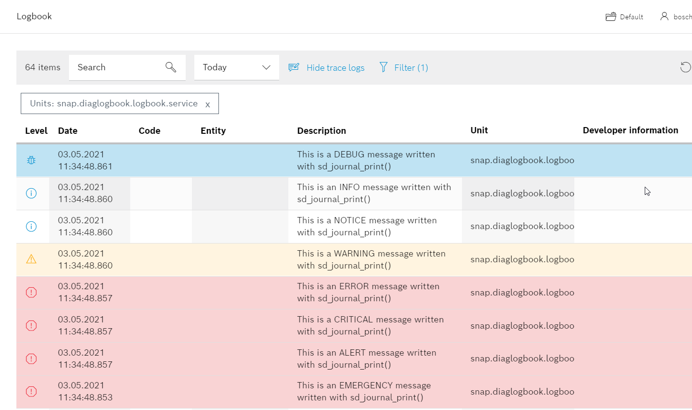

# README

The sample App __diaglogbook__ demonstates how messages are sent to journald and the CtrlX Diagnostics Logbook.

## The using of Linux Kernel  Log Levels

We recommend to use Linux log levels to define the severity of a log message.

There are eight log levels defined by the Linux kernel:

0. EMERGENCY    The system is unusable (and will be shut down)
1. ALERT        There is a severe error, action must be taken immediately
2. CRITICAL     There is a critical error
3. ERROR  A job was aborted in case of an error
4. WARNING     There is an abnormal condition but the actual job can be finished
5. NOTICE     There is a normal but significant condition
6. INFO         A messages informs about an internal state
7. DEBUG     Message shows details regarding program flow or results

__Be carefull with level EMERGENCY: Messages with this level are sent to all consoles!__

## Debug and Run

1. Build the executable via cmake plugin.
2. Launch the app with the debugger attached by pressing __F5__.

## Build and Install the Snap

Build and install the snap like described [here](../README.md).

## Test the Snap

* Open the web interface of your ctrlX CORE
* Check the output of the diagnosis logbook

___

## License

SPDX-FileCopyrightText: Bosch Rexroth AG
SPDX-License-Identifier: MIT
