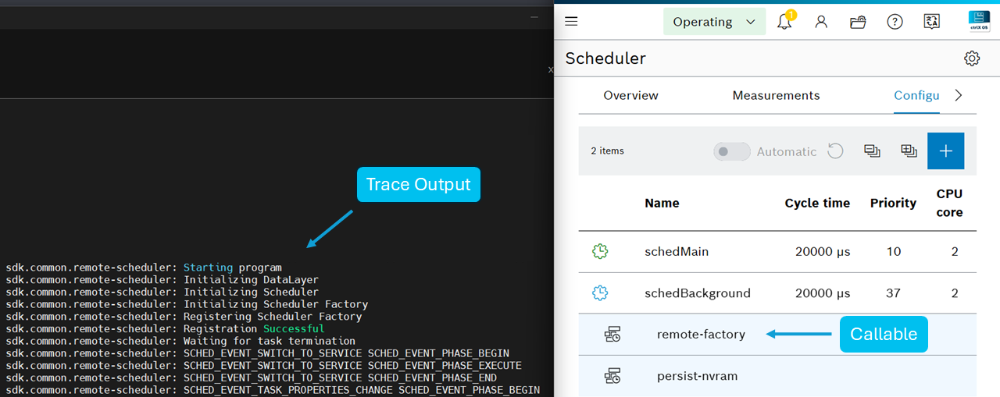

# Remote Scheduler

## Introduction

This sample implements a simple Scheduler callable within its own process space. This eliminates the need to implement a bundle. To achieve this, you must:

* Instantiate a data layer system.
* Instantiate a remote scheduler system.
* Register a callable factory with the remote scheduler system.

## Important things to know

* The `ctrlx-datalayer` and `ctrlx-scheduler` Debian packages are required. Please use the `install-ctrlx-scheduler.sh` script in the scripts folder to install them.
* An app.automationcore instance must be running on your system. The remote scheduler system will communicate with it and register your callable factory.
* For each callable created by your callable factory, a dedicated thread will be created. This thread will inherit the same settings (priority, affinity, etc.) as the thread in the scheduler.
* Your process will be moved to the cgroup ctrlx.os upon the creation of the first callable, allowing your process to utilize all available cores.
* This snap uses the `process-control` interface. As a high-security interface, it does not auto-connect. If your snap is not signed/granted an exception, you must manually run the following with root access after installation:
&emsp; `sudo snap connect sdk-cpp-remote-scheduler:process-control`

## Performance Measurement

The following performance metrics were observed for the Remote Scheduler on the [X3](https://apps.boschrexroth.com/microsites/ctrlx-automation/de/portfolio/ctrlx-core/):

* Minimum Latency: 27µs
* Average Latency: 33µs
* Maximum Latency: 83µs

Based on these measurements, using the Remote Scheduler feature in the X3 introduces a maximum latency of 83µs compared to running within the Celix Framework itself.

## Build and Install the Snap

Build and install the snap as described [see here](../README.md). Once all steps have been executed correctly, the result should resemble the image below.

The following interface must still be set manually after the installation.

```bash
    sudo snap connect sdk-cpp-remote-scheduler:process-control
```

The trace output can be viewed using:

```bash
    sudo snap logs -f sdk-cpp-remote-scheduler`
```

**NOTE:** The usage of traces in the execute method of `factory.h` is only a placeholder for demonstration and should be removed for real-time workloads.



## Debugging

Local debugging is not supported for this sample because it relies on a TCP connection. Therefore, remote debugging must be used. Detailed instructions are available [Remote Debug](https://boschrexroth.github.io/ctrlx-automation-sdk/remote-debug-cpp.html).

To set up remote debugging:

1. Build the snap in debug mode.  
2. Download and install the snap locally on the controller (virtual or hardware-based). Do not switch to Operating mode yet.
3. SSH into the controller and run the following commands:

    ```bash
    sudo snap restart rexroth-automationcore
    sudo snap run --experimental-gdbserver=:12345 sdk-cpp-remote-scheduler.app
    ```

    **Note:** When using a virtual machine, ensure that port forwarding for port `12345` is configured.

4. Return to VS Code and select the pre-defined `launch.json` task `remote <arch>: debug executable`.  

Once the main program loop has successfully started, the remote-factory callable must be manually added in the Scheduler to enable its execution.

## Support

If you've any questions visit the [ctrlX AUTOMATION Community](https://developer.community.boschrexroth.com/)
___

## License

SPDX-FileCopyrightText: Bosch Rexroth AG
SPDX-License-Identifier: MIT
