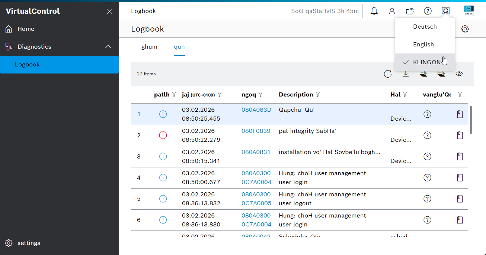

# README custom.language.pack

The sample __custom.language.pack__ is a sample for a custom language pack. The provided sample works as a custom language pack for the constructed language Klingon and can be used as a blueprint for other languages. It is not a officially supported language by Bosch Rexroth. 

## Introduction and intended use

The repository [ctrlx-automation-i18n](https://github.com/boschrexroth/ctrlx-automation-i18n) aggregates translation files of the ctrlX OS system that can be used to translate ctrlX OS into different languages. The repository contains the currently available languages English (en) and German (de) for apps provided by Bosch Rexroth. The language files in this repository can be used as base to translate ctrlX OS into different languages. This example works as a custom language pack for the constructed language Klingon and can be used as a blueprint for other languages.

!!! important
    Bosch Rexroth is not liable for any harm or damage caused by language packs created and published by Third-Parties.

## Build your own Language Pack

The repository **ctrlx-automation-i18n** can be used to create language packs for ctrlX OS. A **language pack** is basically a ctrlX OS App that provides an additional language for the system. To make this work, a snap with the following structure needs to be created (example for french):

```
package-assets/
├── example-language-pack-fr/
│   └── i18n/
│       ├── webapp
│       │   ├── <component>.fr.json
│       │   └── ...
│       ├── <app>.package-manifest.fr.json
│       ├── ...
│       ├── <app>.diagnostics.fr-FR.json
│       └── ...
└── meta/
    └── snap.yaml
```

!!! important
    There can be changes to the language files in the repository **ctrlx-automation-i18n** with every release. The custom language pack therefore might need to be updated/reviewed with every release. 

And the snap needs to provide the language files to the ctrlX OS Device Admin with the `package-assets` slot:

```yaml
slots: 
  package-assets: # The package assets slot shares the content defined in source with the ctrlX OS Device Admin App
    interface: content # Content interface for file sharing between snaps
    content: package-assets # Name of the content interface as expected by ctrlX OS
    source: # Files to share
      read: # Read-only
      - $SNAP/package-assets/${SNAPCRAFT_PROJECT_NAME}
```

## Build the sample 

The sample can be build with the help of the script `build-snap.sh`. It is a example for a custom language pack for the constructed language Klingon. Therfore the language files at `/language-files/klingon` are packed into the snap with the name `klingon-language-pack`.


## Live Look in ctrlX OS

When installed in ctrlX OS the language provided by the language-pack can be selected from the header-bar. 


## Adapt it for your own Language Pack

1. Download Language Repository. For example with the help of `clone-language-repo.sh`. 
2. Translate the files into the language you want. For example with the help of the script `translate.sh`.
3. Rename the files so it matches the structure defined obove. 
4. Adapt the snapcraft.yaml to pack your translated language files.
5. Build and install your custom language pack snap 


## Support

If you've any questions visit the [ctrlX AUTOMATION Community](https://developer.community.boschrexroth.com/)

___

## License

SPDX-FileCopyrightText: Bosch Rexroth AG
SPDX-License-Identifier: MIT