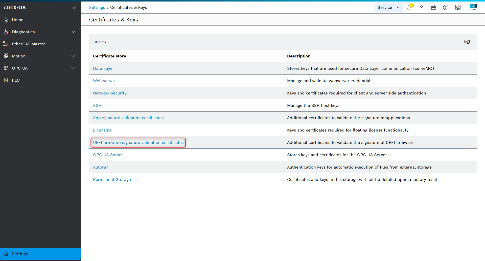

# UEFI firmware updates for ctrlX OS Standard

UEFI firmware needs to be updatable in the field in order to apply security patches, e.g. in case of another [Spectre](https://en.wikipedia.org/wiki/Spectre_(security_vulnerability)) / [Meltdown](https://en.wikipedia.org/wiki/Meltdown_(security_vulnerability)) vulnerability.

On ctrlX CORE devices UEFI firmware updates are contained in the `Hardware Support` app (gadget snap). When you install a new version of the `Hardware Support` app that contains a UEFI firmware update, you will find the option to install the UEFI firmware update under `Settings > Apps > Update UEFI firmware`.

On ctrlX OS Standard devices it is not possible to ship UEFI firmware updates via the `Hardware Support` app as the same app is running on devices of multiple ctrlX OS partners with different UEFI firmware implementations.

Nevertheless, ctrlX OS Standard offers a secure and convenient way to deploy UEFI firmware updates.

## Prerequisites

UEFI firmware updates must be UEFI update capsules and must comply to the [UEFI specification](https://uefi.org/specs/UEFI/2.11/08_Services_Runtime_Services.html#update-capsule).

!!! Hint
    We strongly recommend to use update capsules with the [Firmware Management Protocol (FMP)](https://uefi.org/specs/UEFI/2.11/23_Firmware_Update_and_Reporting.html) and with required authentication (`IMAGE_ATTRIBUTE_AUTHENTICATION_REQUIRED`).
    This provides an additional layer of security where the UEFI firmware itself will verify the integrity of the update capsule before executing it.
    You will need to inquire with your UEFI firmware vendor if FMP with required authentication is supported.

## Preparing a UEFI firmware update for ctrlX OS Standard

When uploading a UEFI firmware update to a ctrlX OS Standard device it will be checked if the update is from a trusted origin.

The certificates for trusted origins should be deployed onto the ctrlX OS Standard device during manufacturing, but can also be updated with the appropriate user permissions during runtime.

The UEFI firmware update must be provided as a `.fwupdate` archive.

### Provisioning UEFI firmware signature validation certificates

Your user on the ctrlX OS Standard device requires the `Certificates & Keys > Manage` permission to upload new trusted certificates for UEFI firmware updates.
Make sure this permission is only available for authorized users to prevent misuse.

The private and public key with which UEFI firmware updates are signed should be owned and maintained by the ctrlX OS Standard device manufacturer.

An example how to generate P-384 ECDSA public and private keys with SHA-384 and the corresponding certificate can be found in [this example shell script using `openssl`](/public/scripts/firmware-generate-keys.sh).

!!! Hint
    Only P-384 ECDSA keys and SHA-384 are currently supported.

!!! Danger
    Take care of your private ctrlX OS UEFI firmware key and establish measures to protect against misuse and key leakage, like using an HSM.

To add a new trusted certificate for UEFI firmware updates go to `Settings > Certificate & Keys > UEFI firmware signature validation certificates`. 

Upload your certificate in category `Trusted`.

!!! Hint
    You can also manage your certificates with REST via the [ctrlX OS - Apps Management API](https://boschrexroth.github.io/rest-api-description/ctrlx-automation/ctrlx-core/).

### Packaging a UEFI firmware update as a `.fwupdate` archive

The UEFI firmware update must be provided in a proprietary `.fwupdate` archive to ctrlX OS Standard.

The `.fwupdate` is a `tar` archive that contains:

- `*.bin` file: The UEFI firmware update itself.
- `*.signature` file: A detached signature for the digest of the UEFI firmware update

UEFI firmware updates are usually provided as [Cabinet](https://en.wikipedia.org/wiki/Cabinet_(file_format)) archives by UEFI firmware vendors.
In addition to the update itself they often contain metadata information for [Windows (as a `firmware.inf` file)](https://learn.microsoft.com/en-us/windows-hardware/drivers/bringup/authoring-an-update-driver-package) and for [LVFS (as a `*.metainfo.xml` file)](https://lvfs.readthedocs.io/en/latest/metainfo.html#metadata).

Using the [`firmware-signing-tool.sh` script](/public/scripts/firmware-signing-tool.sh) you can repackage a UEFI firmware update from a `Cabinet` into a `.fwupdate`archive and create the detached signature.

!!! Hint
    Make sure all the required dependencies are installed by running [`install-ctrlx-os-dev-tools.sh`](/public/scripts/install-ctrlx-os-dev-tools.sh).

!!! Danger
    ctrlX OS Standard does not prevent potential UEFI firmware downgrades. As a ctrlX OS Standard device manufacturer it is your responsibility to inform your device operators about your process to install UEFI firmware updates in a forward-only manor.
    Update capsules with FMP support can express [Version dependencies](https://uefi.org/specs/UEFI/2.11/23_Firmware_Update_and_Reporting.html#dependency-expression-instruction-set) so that the UEFI firmware itself can prevent potential downgrades. Contact your UEFI firmware vendor for more details.

### Installing a `.fwupdate` archive on ctrlX OS

!!! Hint
    On ctrlX OS variants that deliver UEFI firmware updates via the `Hardware Support` app the following workflow is not supported.

Upload your `.fwupdate` archive under `Settings > Apps` with `Upload UEFI firmware`.

On successful upload a new button `Update UEFI firmware` will appear. 
Click it and carefully read and confirm the pop-ups to start the UEFI firmware update process.

!!! Hint
    An uploaded `.fwupdate` is not persisted on the device. If you restart the device before starting the UEFI firmware update as described above you will have to reupload the `.fwupdate` archive.