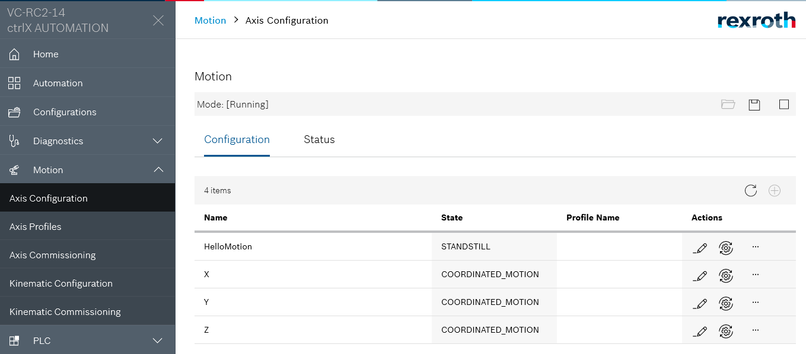
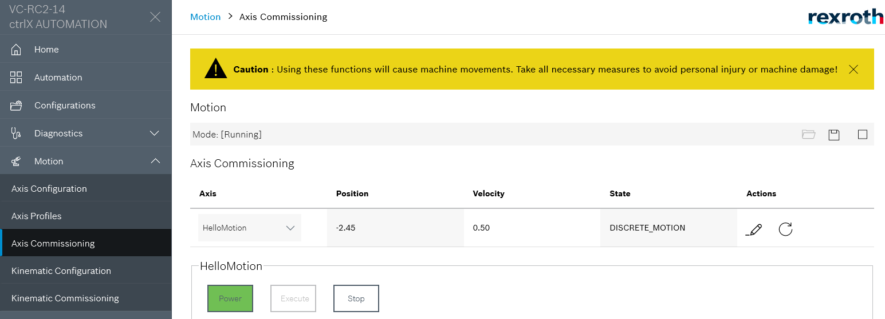
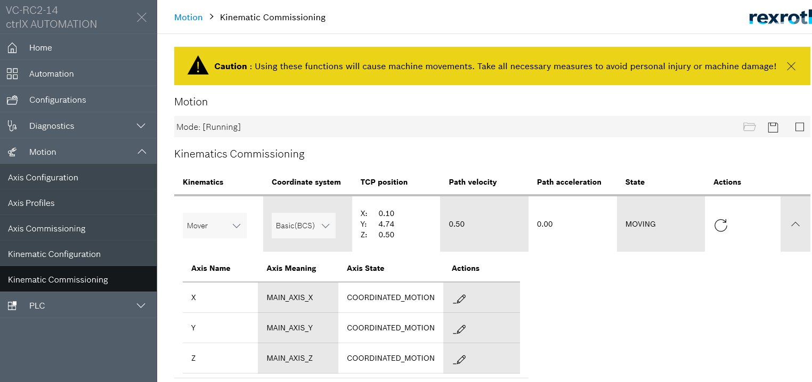
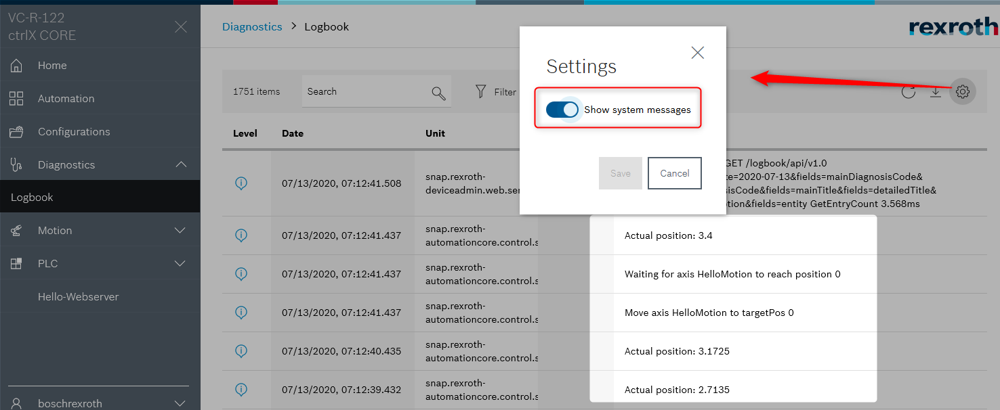

# README automation.bundle

## Description

The sample app __automation.bundle__ creates a celix bundle together with the motion component.
It includes a hello world and motion commands for axis and kinematics.

## Prerequisites

* Buildenvironment WSL or Virtual Box
* ctrlX AUTOMATION SDK Version 1.2
* ctrlX COREvirtual or ctrlX CORE

## Requirements and dependencies

This example requires the snap `rexroth-automationcore` and `rexroth-motion` installed on ctrlX CORE device.

## Getting Started

1. Launch IDE (VSCode for example)
2. Open the sample directory `samples-cpp/automation.bundle`
3. Build and install the snap as described in `Setup` section
4. Check output in the web interface

## Screenshots

## Troubleshooting

All automatically created files are located in folders `build` and `generated`.  
If there are unclear messages during the build process, it might help to delete the folders `build` and `generated` and restart the build process.

## Support

If you've any questions visit the [ctrlX AUTOMATION Community](https://developer.community.boschrexroth.com/)

___

## License

MIT License

Copyright (c) 2020-2021 Bosch Rexroth AG

Permission is hereby granted, free of charge, to any person obtaining a copy
of this software and associated documentation files (the "Software"), to deal
in the Software without restriction, including without limitation the rights
to use, copy, modify, merge, publish, distribute, sublicense, and/or sell
copies of the Software, and to permit persons to whom the Software is
furnished to do so, subject to the following conditions:

The above copyright notice and this permission notice shall be included in all
copies or substantial portions of the Software.

THE SOFTWARE IS PROVIDED "AS IS", WITHOUT WARRANTY OF ANY KIND, EXPRESS OR
IMPLIED, INCLUDING BUT NOT LIMITED TO THE WARRANTIES OF MERCHANTABILITY,
FITNESS FOR A PARTICULAR PURPOSE AND NONINFRINGEMENT. IN NO EVENT SHALL THE
AUTHORS OR COPYRIGHT HOLDERS BE LIABLE FOR ANY CLAIM, DAMAGES OR OTHER
LIABILITY, WHETHER IN AN ACTION OF CONTRACT, TORT OR OTHERWISE, ARISING FROM,
OUT OF OR IN CONNECTION WITH THE SOFTWARE OR THE USE OR OTHER DEALINGS IN THE
SOFTWARE.
