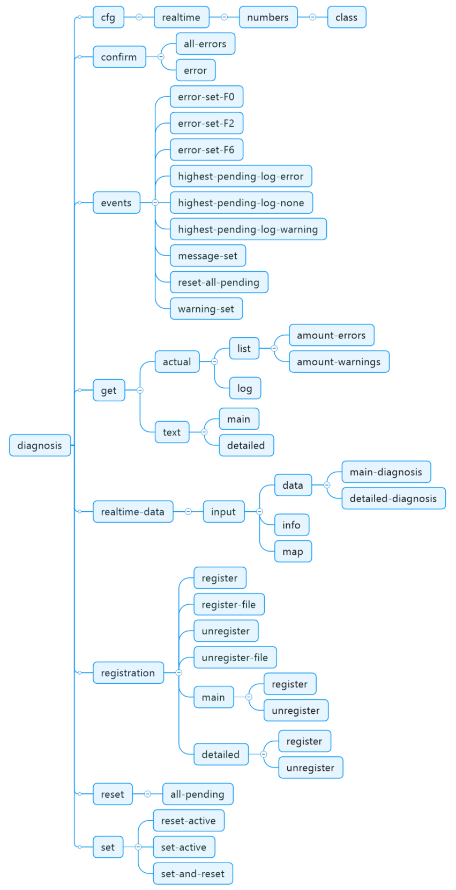

# ctrlX Data Layer Diagnosis

This sample app uses some Data Layer addresses to handle with diagnostics.

## Introduction

It demonstrates how to
* register and unregister diagnostics
* subscribe to specific diagnostic events
* set and reset diagnostic logs
* confirm diagnostic errors
* get the highest priority pending log
* get the actual pending list of errors and warnings
* get diagnostic texts from diagnostic numbers

## Prerequisites

* Installed app rexroth-automationcore

## Build and Install the Snap

Build and install the snap like described [here](../README.md).

## Test the Snap

* Open the web interface of your ctrlX CORE
* Check output in the web interface

___

## License

MIT License

Copyright (c) 2021-2022 Bosch Rexroth AG

Permission is hereby granted, free of charge, to any person obtaining a copy
of this software and associated documentation files (the "Software"), to deal
in the Software without restriction, including without limitation the rights
to use, copy, modify, merge, publish, distribute, sublicense, and/or sell
copies of the Software, and to permit persons to whom the Software is
furnished to do so, subject to the following conditions:

The above copyright notice and this permission notice shall be included in all
copies or substantial portions of the Software.

THE SOFTWARE IS PROVIDED "AS IS", WITHOUT WARRANTY OF ANY KIND, EXPRESS OR
IMPLIED, INCLUDING BUT NOT LIMITED TO THE WARRANTIES OF MERCHANTABILITY,
FITNESS FOR A PARTICULAR PURPOSE AND NONINFRINGEMENT. IN NO EVENT SHALL THE
AUTHORS OR COPYRIGHT HOLDERS BE LIABLE FOR ANY CLAIM, DAMAGES OR OTHER
LIABILITY, WHETHER IN AN ACTION OF CONTRACT, TORT OR OTHERWISE, ARISING FROM,
OUT OF OR IN CONNECTION WITH THE SOFTWARE OR THE USE OR OTHER DEALINGS IN THE
SOFTWARE.
