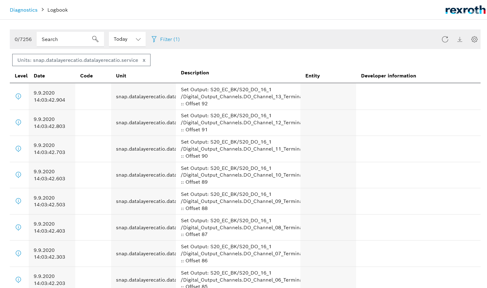

# data Layer EtherCAT IO

This sample app toggles some Fieldbus I/O's.

## Introduction

It demonstrate how it is possible to read inputs and write outputs. It starts to toggle the outputs while the first channel of the input is set to true.

## Prerequisites for the ctrlX CORE

* ctrlX EtherCAT Master App
* ctrlX I/O Engineering
* S20-EC-BK
* S20-DI-16
* S20-DO-16

## Debug and Run

1. Build the executable via build-debug.sh (or cmake plugin).
2. Launch the app with the debugger attached by pressing __F5__.

## Build and Install the Snap

Build and install the snap like described [here](../README.md).

## Test the Snap

* Open the web interface of your ctrlX CORE
* Check output in the web interface

___

## License

SPDX-FileCopyrightText: Bosch Rexroth AG
SPDX-License-Identifier: MIT
