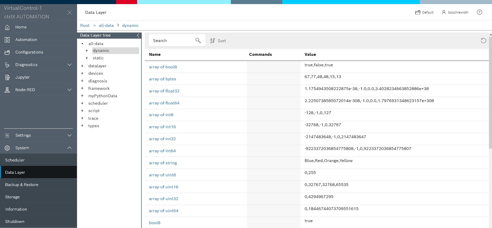

# AllDataProvider App 

This cpp sample app is a Data Layer Provider which can be used in two wayes:

1. As a sample how in cpp variables of different data types can be involved into Data Layer Variants.
2. As a test Data Layer Provider during development of a Data Layer Client. These client apps can be written in one of the SDK supported languages or can be Node-RED or REST API applications.

## Introduction

The AllDataProvider creates two Data Layer branches: `all-data/dynamic` and `all-data/static`. 

The branches are providing sub nodes for most of the Data Layer Variant types.

The static branch and its nodes cannot be changed by Data Layer Client interactions. It can be used to read data and to test the min and max data values within the own application.

The dynamic branch however is changeable. Nodes can be written or even deleted by clients. Furthermore new nodes or whole sub branches can be created.

## Pre-requisites

* Build Environment: Ubuntu 18.4 installed on WSL or Virtual Box VM
* ctrlX AUTOMATION SDK Version 1.8 
* ctrlX COREvirtual or ctrlX CORE

## Getting Started

1. Launch IDE (VSCode for example)
2. Open the sample directory `public/samples-cpp/datalayer.provider.all-data`
3. Build and install the snap as described in `Setup` section
4. Check output in the web interface

## Implementation

### main.cpp

The main function establishes the Data Layer connection. If the app is running within a snap on the ctrlX a IPC connection is used automatically. This connection doesn't need user credentials.

For a debugging session or in remote mode a tcp connection which need user credentials and an address is used. Therefore in the code user, password and address are predefined with default values.

**Important:** 
Do NOT use this default values!
* Add a separate user/password for this app in your ctrlX and change values in the code.
* Check the IP address of your ctrlX and change the value in the code if it is different.

Hint: Use 127.0.0.1 as address if you are working with a ctrlX COREvirtual connected with Port Forwarding.

### DataContainer Class

DataContainer is a simple data container class representing the data and error state of a node seen in the dynamic and/or static branch.

### ProviderNodeAllData Class

ProviderNodeAllData is a IProviderNode implementation and provides a Data Layer sub branch. The sub branch can be static or dynamic.
Static means that the values of the nodes and the structure of he branch  cannot be changed by Data Layer clients. In a dynmic branch everthing kann be changed.

All nodes of such a sub branch are 'virtual' because the node behind is always the same ProviderNodeAllData instance. Therefore it registers itself with a wildcard address (e.g. all-data/dynamic/\*\*) at the Data Layer. The 'seen' nodes are DataContainer instances managed in a list and accessed by the on... callback functions of the ProviderNodeAllData class. 
  
## Screenshots

## Troubleshooting

All automatically created files are located in folders `build` and `generated`.  
If there are unclear messages during the build process, it might help to delete the folders `build` and `generated` and restart the build process.

## Support

If you've any questions visit the [ctrlX AUTOMATION Communitiy](https://developer.community.boschrexroth.com/)

___

## License

MIT License

Copyright (c) 2021 Bosch Rexroth AG

Permission is hereby granted, free of charge, to any person obtaining a copy
of this software and associated documentation files (the "Software"), to deal
in the Software without restriction, including without limitation the rights
to use, copy, modify, merge, publish, distribute, sublicense, and/or sell
copies of the Software, and to permit persons to whom the Software is
furnished to do so, subject to the following conditions:

The above copyright notice and this permission notice shall be included in all
copies or substantial portions of the Software.

THE SOFTWARE IS PROVIDED "AS IS", WITHOUT WARRANTY OF ANY KIND, EXPRESS OR
IMPLIED, INCLUDING BUT NOT LIMITED TO THE WARRANTIES OF MERCHANTABILITY,
FITNESS FOR A PARTICULAR PURPOSE AND NONINFRINGEMENT. IN NO EVENT SHALL THE
AUTHORS OR COPYRIGHT HOLDERS BE LIABLE FOR ANY CLAIM, DAMAGES OR OTHER
LIABILITY, WHETHER IN AN ACTION OF CONTRACT, TORT OR OTHERWISE, ARISING FROM,
OUT OF OR IN CONNECTION WITH THE SOFTWARE OR THE USE OR OTHER DEALINGS IN THE
SOFTWARE.
