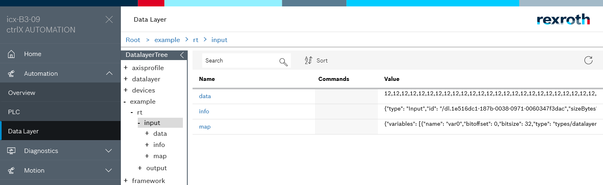

# README datalayer.realtime

The sample app __datalayer.realtime__ shows the realtime access via the ctrlX Data Layer.

## Introduction

It demonstrates how you can provide some realtime data (memory owner) and work with these data (memory user).

The memory owner creates some `input` and `output` memory and defines the layout of the memory map.
The memory user can read `input` and write `output`.  
When the user has written outputs once, the owner will start copying from output to input.

## Prerequisites

* Build environment - we recommend a QEMU virtual machine
* ctrlX AUTOMATION SDK archive
* ctrlX COREvirtual or ctrlX CORE

### Prerequisites for Building the cpp Samples on the Build Environment

* Start your build environment
* Copy the ctrlX AUTOMATION SDK archive from your host computer to your build environment:

    scp -P 10022 com.boschrexroth.sdk.control-*.zip boschrexroth@localhost:~

* Open a SSH shell on your build environment:

    ssh -p 10022 boschrexroth@localhost

* Unzip the archive

    unzip -XK com.boschrexroth.sdk.control-*.zip

* Change to SDK directory public
* Set x flag: 

    chmod +x bin\oss.flatbuffers\u*\release\flatc

* If installed remove older ctrlx-datalayer package

    sudo dpkg -r ctrlx-datalayer 

* Install newest ctrlx-datalayer package

    sudo dpkg -i deb/ctrlx-datalayer*.deb

## Getting Started

1. Launch IDE (VSCode for example)
2. Open the sample directory `samples-cpp/datalayer.realtime`
3. Build and install the snap as described `Setup` section
4. Check output in the web interface

## Screenshots

## Troubleshooting

All automatically created files are located in folders `build` and `generated`.  
If there are unclear messages during the build process, it might help to delete the folders `build` and `generated` and restart the build process.

## Support

If you've any questions visit the [ctrlX AUTOMATION Community](https://developer.community.boschrexroth.com/)

___

## License

MIT License

Copyright (c) 2020-2021 Bosch Rexroth AG

Permission is hereby granted, free of charge, to any person obtaining a copy
of this software and associated documentation files (the "Software"), to deal
in the Software without restriction, including without limitation the rights
to use, copy, modify, merge, publish, distribute, sublicense, and/or sell
copies of the Software, and to permit persons to whom the Software is
furnished to do so, subject to the following conditions:

The above copyright notice and this permission notice shall be included in all
copies or substantial portions of the Software.

THE SOFTWARE IS PROVIDED "AS IS", WITHOUT WARRANTY OF ANY KIND, EXPRESS OR
IMPLIED, INCLUDING BUT NOT LIMITED TO THE WARRANTIES OF MERCHANTABILITY,
FITNESS FOR A PARTICULAR PURPOSE AND NONINFRINGEMENT. IN NO EVENT SHALL THE
AUTHORS OR COPYRIGHT HOLDERS BE LIABLE FOR ANY CLAIM, DAMAGES OR OTHER
LIABILITY, WHETHER IN AN ACTION OF CONTRACT, TORT OR OTHERWISE, ARISING FROM,
OUT OF OR IN CONNECTION WITH THE SOFTWARE OR THE USE OR OTHER DEALINGS IN THE
SOFTWARE.
