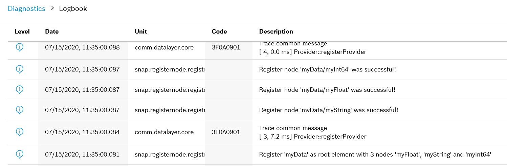
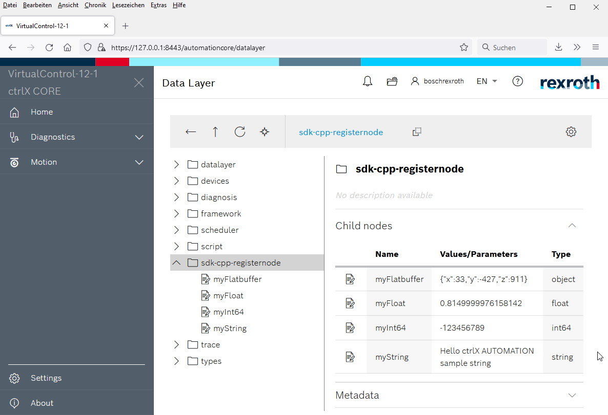

# README datalayer.register.node

## Introduction

The sample app __datalayer.register.node__ creates a new provider with node '__sdk-cpp-registernode__' and different type elements to the ctrlX Data Layer.

## Functional Description

It demonstrates how you can create Data Layer nodes with different data types.
These nodes can be accessed by a Data Layer client app e.g. ctrlX-Node-RED.

## Implementation Description

All actions are implemented in main.cpp:

* Start Data Layer system
* Connect as Data Layer provider
* Register a flatbuffers schema
* Register several Data Layer nodes
* Endless loop where the Data Layer connection is observed
* Shutdown if the Data Layer connection is broken

!!! important
    If the app is running as snap on a ctrlX CORE it will be restarted if it has exited on error. 

## Build and Install the Snap

Build and install the snap like described [here](../README.md).

## Test the Snap

* Open the web interface of your ctrlX CORE
* Check output in the web interface

___

## License

MIT License

Copyright (c) 2020-2021 Bosch Rexroth AG

Permission is hereby granted, free of charge, to any person obtaining a copy
of this software and associated documentation files (the "Software"), to deal
in the Software without restriction, including without limitation the rights
to use, copy, modify, merge, publish, distribute, sublicense, and/or sell
copies of the Software, and to permit persons to whom the Software is
furnished to do so, subject to the following conditions:

The above copyright notice and this permission notice shall be included in all
copies or substantial portions of the Software.

THE SOFTWARE IS PROVIDED "AS IS", WITHOUT WARRANTY OF ANY KIND, EXPRESS OR
IMPLIED, INCLUDING BUT NOT LIMITED TO THE WARRANTIES OF MERCHANTABILITY,
FITNESS FOR A PARTICULAR PURPOSE AND NONINFRINGEMENT. IN NO EVENT SHALL THE
AUTHORS OR COPYRIGHT HOLDERS BE LIABLE FOR ANY CLAIM, DAMAGES OR OTHER
LIABILITY, WHETHER IN AN ACTION OF CONTRACT, TORT OR OTHERWISE, ARISING FROM,
OUT OF OR IN CONNECTION WITH THE SOFTWARE OR THE USE OR OTHER DEALINGS IN THE
SOFTWARE.
