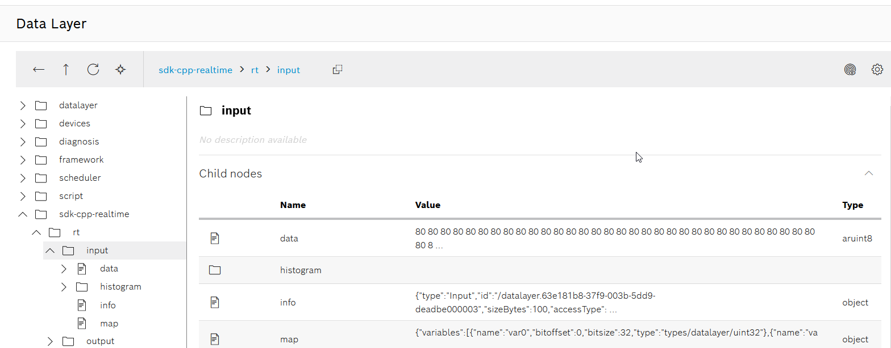

# README sdk.cpp.datalayer.sharedmemory

## Introduction

This sample project shows how shared memory is used for data exchange between two applications. 

Therefor the features of the ctrlX Data Layer are used.

Normally realtime applications (Celix bundles) are using sharded memory for data exchange, but non realtime apps are also able to use it - like our two executables.

!!! important
    Executables using shared memory for data exchange have to run within the same environment (ctrlX CORE or App Builder Environment). 
    Shared memory over a TCP connection is NOT possible.

## Function Description

  When the user has written outputs once, the owner will start copying from output to input.

* The owner executable provides two shared memory areas.
* From the perspective of the user executable their names are 'input' and 'output'.
* The user reads the input data, increments the values and writes them to the output area.
* The owner copies the changed values to the input area.
* Then again the user reads and increases them.
* When the numerical value has reached 225, the user app sets it back to 1.

__If the input values are 0 this indicates that the user had no access - this is an error situation.__

## Implementation

__main_owner.cpp__ implements the owner app and __main_user.cpp__ the user app.

### main_owner.cpp

If the  executable is running in the App Builder Environment it has to start the ctrlX Data Layer system with the parameter `boStartBroker=true`.
In this case the ctrlX Data Layer broker which handles the shared memory features is started also within the App Builder Environment.

Running on the ctrlX CORE the owner has to start the ctrlX Data Layer system with the parameter `boStartBroker=false` because the ctrlX Data Layer broker has already been started by the rexroth-automationcore snap.

Because shared memory is used, the ctrlX Data Layer (and it's broker) must run on the same environment. Accordingly, the provider connection string must always be __DL_IPC__ (ipc://).

After connecting to the ctrlX Data Layer shared memories for input and output are created and both fitted with the same memory map. The memory map is internally a Flatbuffers describing the data structure of the shared memory.

After the values of the shared memory are set to 0 the owner apps waits in an endless loop for our user app to read and change the values.

### main_user.cpp

* The user app starts the ctrlX Data Layer system always with `boStartBroker=false`. For the access of shared memory provided by an other process the user app does not require a ctrlX Data Layer client connection.

* The user tries to read the memory map of the input area. This is done in a loop until it succeeds.

* In an endless loop all values of the input area are read, incremented and written to the output area.

* The value is changed from 255 to 1 - 0 is skipped.

## Debug and Run

1. Build the executable via cmake plugin.
2. Launch the app with the debugger attached by pressing __F5__.

## Build and Install the Snap

Build and install the snap like described [here](../README.md).

To use shared memory in the restricted snap environment of the ctrlX CORE our snap has to be connected to the datalayer-shm slot provided by the snap rexroth-automation-core snap.

Unfortunately for unsigned snaps this is not done automatically during the ctrlX snap installation.

As a workaround this has to be done manually. Therefor open a ssh connection to the ctrlX and enter:

    sudo snap connect sdk-cpp-sharedmemory:datalayer-shm rexroth-automationcore:datalayer-shm

## Test the Snap

* Open the web interface of your ctrlX CORE
* Select Settings --> ctrlX Data Layer
* Select the node sdk/cpp/datalayer/sharedmemory/input
* __The values in the byte array should be changed - AND NEVER be 0. This can be used by a test criterion.__

___

## License

SPDX-FileCopyrightText: Bosch Rexroth AG
SPDX-License-Identifier: MIT

