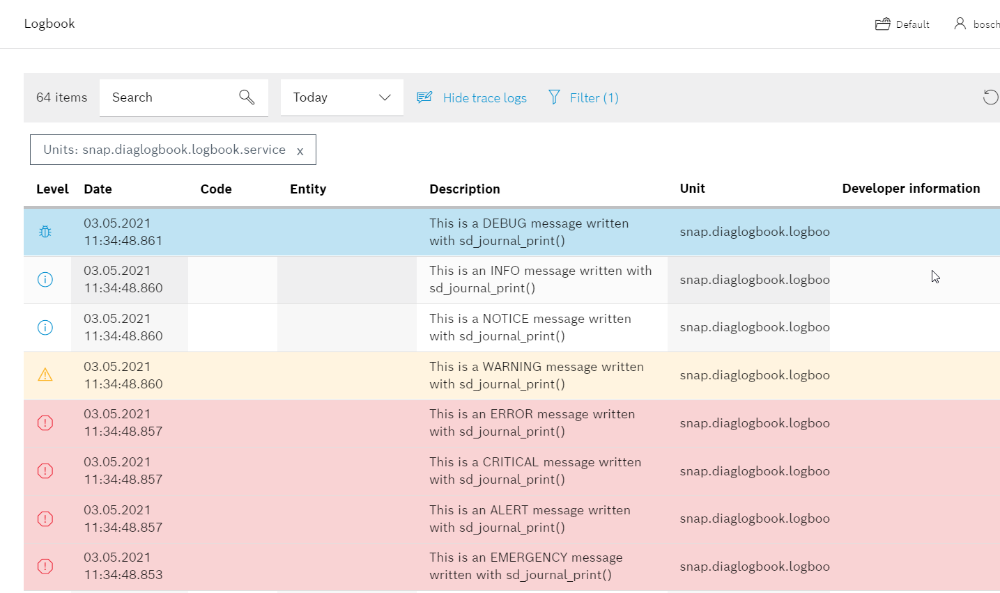

# README 

The sample App __diaglogbook__ demonstates how messages are sent to journald and the CtrlX Diagnostics Logbook.

## Prerequisites

* Build environment WSL or Virtual Box
* ctrlX AUTOMATION SDK
* ctrlX COREvirtual or ctrlX CORE

## The using of Linux Kernel  Log Levels

We recommend to use Linux log levels to define the severity of a log message.

There are eight log levels defined by the Linux kernel:

0. EMERGENCY    The system is unusable (and will be shut down)
1. ALERT        There is a severe error, action must be taken immediately
2. CRITICAL	    There is a critical error
3. ERROR		A job was aborted in case of an error
4. WARNING	    There is an abnormal condition but the actual job can be finished
5. NOTICE	    There is a normal but significant condition
6. INFO         A messages informs about an internal state
7. DEBUG	    Message shows details regarding program flow or results

__Be carefull with level EMERGENCY: Messages with this level are sent to all consoles!__

## Getting Started

1. Launch IDE (VSCode for example)
2. Open the sample directory `samples-cpp/diagnostics.logbook`
3. Build and install the snap as described `Setup` section
4. Check output in the web interface

## Troubleshooting

All automatically created files are located in folders `build` and `generated`.  
If there are unclear messages during the build process, it might help to delete the folders `build` and `generated` and restart the build process.

## Support

If you've any questions visit the [ctrlX AUTOMATION Community](https://developer.community.boschrexroth.com/)

___

## License

MIT License

Copyright (c) 2020-2021 Bosch Rexroth AG

Permission is hereby granted, free of charge, to any person obtaining a copy
of this software and associated documentation files (the "Software"), to deal
in the Software without restriction, including without limitation the rights
to use, copy, modify, merge, publish, distribute, sublicense, and/or sell
copies of the Software, and to permit persons to whom the Software is
furnished to do so, subject to the following conditions:

The above copyright notice and this permission notice shall be included in all
copies or substantial portions of the Software.

THE SOFTWARE IS PROVIDED "AS IS", WITHOUT WARRANTY OF ANY KIND, EXPRESS OR
IMPLIED, INCLUDING BUT NOT LIMITED TO THE WARRANTIES OF MERCHANTABILITY,
FITNESS FOR A PARTICULAR PURPOSE AND NONINFRINGEMENT. IN NO EVENT SHALL THE
AUTHORS OR COPYRIGHT HOLDERS BE LIABLE FOR ANY CLAIM, DAMAGES OR OTHER
LIABILITY, WHETHER IN AN ACTION OF CONTRACT, TORT OR OTHERWISE, ARISING FROM,
OUT OF OR IN CONNECTION WITH THE SOFTWARE OR THE USE OR OTHER DEALINGS IN THE
SOFTWARE.
