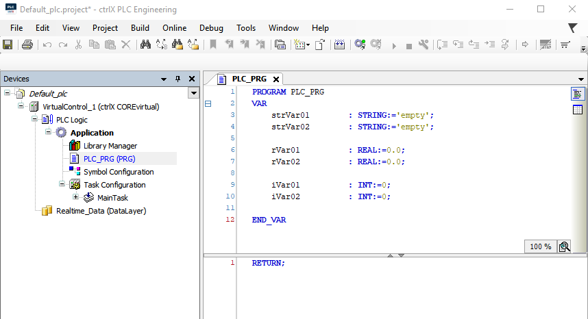
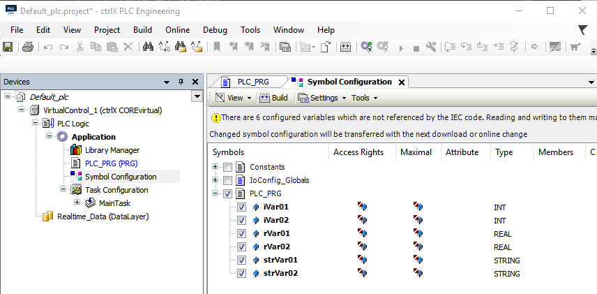
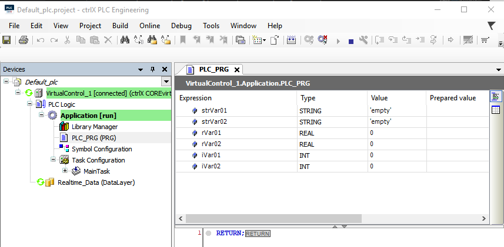
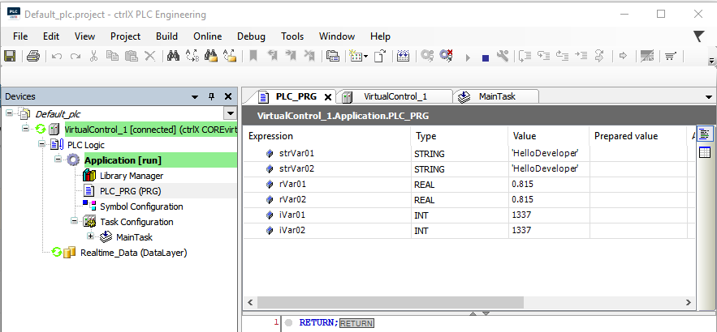
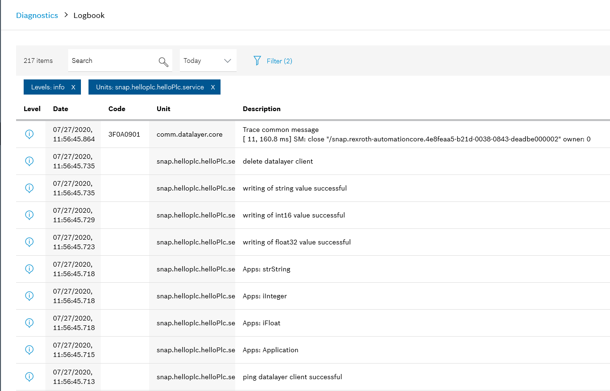

# README hello.plc

The sample project __hello.plc__ shows the write access to some ctrlX PLC variables as:

* a datalayer client on ctrlX CORE or ctrlX CORE Virtual

## Introduction

When the app has been started, all variables from the PLC program "PLC_PRG" that are present in the PLC symbol configuration will be read out.
Then the following is executed once:

* the value "HelloDeveloper" is written to each variable of type STRING.
* the value "1337" is written to each variable of type INT16 (ctrlX-Plc: INT).
* the value "0.815f" is written in each variable of type FLOAT32 (ctrlX-Plc: REAL).

All other data types are ignored.

## Pre-requisites

* Buildenvironment WSL or Virtual Box
* This sample requires the snap `rexroth-plc` installed on ctrlX CORE device.
* Prepare a PLC Program with `ctrlX PLC Engineering`:
  (`ctrlX PLC Engineering` is a desktop program and a part of the ctrlX WORKS installation)
  * make sure that the control is running
  * connect and open the ctrlX CORE web interface
  * from here start the `ctrlX PLC Engineering`
  * open the default plc-program "PLC_PRG" in `ctrlX PLC Engineering`
  * declare some plc variables with datatype STRING, INT and REAL
  * add the object 'Symbolconfiguration' to your Application
  * open the 'Symbolconfiguration' and select the program 'PLC_PRG'
  * download and start the plc-program to you control

## Getting Started

1. Setup WSL or VBox
2. Launch IDE (VSCode for example)
3. Open the sample directory `samples-cpp/hello.plc`
4. Build and install the snap as described `Setup` section
5. Check output in the web interface
6. Login with `ctrlX PLC Engineering` and watch the values of the variables. Variables in the PLC program "PLC_PRG" that are available in the PLC symbol configuration should have the following values:
    * STRING variables should have the value "HelloDeveloper".
    * INTEGER variables should have the value "1337"
    * REAL variables should have the value "0.815f"

## Screenshots

_Declare some plc variables_

_symbolconfiguration PLC_PRG selected_

_Status of the plc-variables before the snap runs_

_Status of the plc-variables after the snap runs_

_Output in diagnosis logbook_

## Troubleshooting

All automatically created files are located in folders `build` and `generated`.  
If there are unclear messages during the build process, it might help to delete the folders `build` and `generated` and restart the build process.

## Support

If you've found an error in these sample, please [file an issue](https://github.com/boschrexroth)

If you've any questions visit the [ctrlX AUTOMATION Communitiy](https://developer.community.boschrexroth.com/)

___

## Official Documentation

<https://docs.automation.boschrexroth.com/>

## License

MIT License

Copyright (c) 2020-2021 Bosch Rexroth AG

Permission is hereby granted, free of charge, to any person obtaining a copy
of this software and associated documentation files (the "Software"), to deal
in the Software without restriction, including without limitation the rights
to use, copy, modify, merge, publish, distribute, sublicense, and/or sell
copies of the Software, and to permit persons to whom the Software is
furnished to do so, subject to the following conditions:

The above copyright notice and this permission notice shall be included in all
copies or substantial portions of the Software.

THE SOFTWARE IS PROVIDED "AS IS", WITHOUT WARRANTY OF ANY KIND, EXPRESS OR
IMPLIED, INCLUDING BUT NOT LIMITED TO THE WARRANTIES OF MERCHANTABILITY,
FITNESS FOR A PARTICULAR PURPOSE AND NONINFRINGEMENT. IN NO EVENT SHALL THE
AUTHORS OR COPYRIGHT HOLDERS BE LIABLE FOR ANY CLAIM, DAMAGES OR OTHER
LIABILITY, WHETHER IN AN ACTION OF CONTRACT, TORT OR OTHERWISE, ARISING FROM,
OUT OF OR IN CONNECTION WITH THE SOFTWARE OR THE USE OR OTHER DEALINGS IN THE
SOFTWARE.