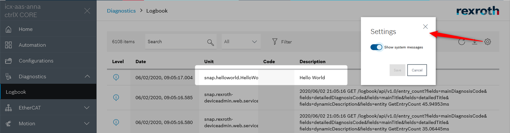

# README hello.world

The sample __hello.world__ print out "Hello World" on CtrlX CORE.

## Introduction

This sample demonstrates how you can build your first C/C++ snap.

The project __hello.world__ provides a simple application example to print out "Hello World" in ctrlX CORE devices: ctrlX CORE or ctrlX COREvirtual.

## Troubleshooting

All automatically created files are located in folders `build` and `generated`.
If there are unclear messages during the build process, it might help to delete the folders `build` and `generated` and restart the build process.

## Support

If you've any questions visit the [ctrlX AUTOMATION Community](https://developer.community.boschrexroth.com/)

___

## License

SPDX-FileCopyrightText: Bosch Rexroth AG
SPDX-License-Identifier: MIT
