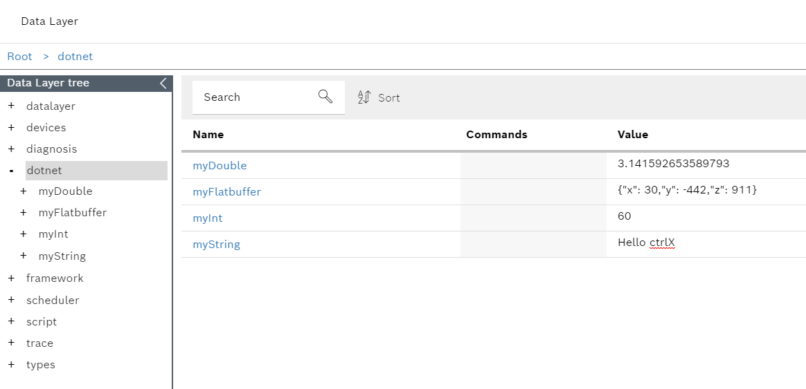

# README .NET datalayer.provider.simple

This .NET sample provides some registered nodes to the ctrlX Data Layer tree. 

__IMPORTANT__:

The sample creates and registers all nodes individually, which is recommended for _small_ to _medium_ sized set of nodes to handle. If you're dealing with a _large_ set of nodes (big data provider) or any _dynamic node hierarchy_, we recommend to use a _virtual provider_ approach, listening just to any _wildcarded address_ ( e.g. myRoot/**) and using _self-managed virtual nodes_, just returned in _OnBrowse()_ method, which is more efficient.

Please read the _Best Practise_ section in common .NET documentation for more details and recommended samples.

## Introduction

The sample demonstrates how to provide nodes to ctrlX Data Layer tree. 
The provider creates nodes with types of int/double/string. 
Also a complex type encoded by [FlatBuffers](https://google.github.io/flatbuffers/) is provided.

## Description

The sample demonstrates 

+ How to provide nodes with different data types to __ctrlX Data Layer__

+ How to create and provide meta data to nodes

+ How to provide nodes with read-only or read-write support
  
+ How to register a user defined flatbuffers type

## Prerequisites

Please read the common .NET docs [here](./../../doc/dotnet.md), first.

## Debug and Run
Launch the app with the debugger attached by pressing __F5__.

## Build and Install

1. Launch Visual Studio Code
2. Click on the __Remote Explorer__ from the menu.
3. Choose __Open Folder__.
4. Open the directory __datalayer.provider__.
5. Build and install snap as described [here](./../README.md).
6. Checkout ctrlX Data Layer web frontend (Settings | Data Layer) 
7. Check the output using __Diagnostics__:

   - Login into your ctrlX
   - Navigate to __Diagnostics -> Logbook__
   - Click __Settings__ on the right top corner
   - Enable __Show system messages__
   - Navigate to __Filter -> Units__ and check your __snap.sdk-net-provider.app.service__
   - Now you should the see the app output diagnostics.
   - Press __Refresh__ to update.

8. If you have root permissions, you can also watch the output on any ssh console with the command:
   ```bash
   sudo snap logs sdk-net-provider.app -f | more
   
## Screenshot



## Install the App

Login into ctrlX and install the App (Apps).

## Gratulations - We're finished - Let's start coding!


## Support
### Developer Community

Please join the [Developer Community](https://developer.community.boschrexroth.com/) 

### SDK Forum

Please visit the [SDK Forum](https://developer.community.boschrexroth.com/t5/ctrlX-AUTOMATION/ct-p/dcdev_community-bunit-dcae/) 

### Issues

If you've found an error in these sample, please [file an issue](https://github.com/boschrexroth)

## License

SPDX-FileCopyrightText: Bosch Rexroth AG
SPDX-License-Identifier: MIT
