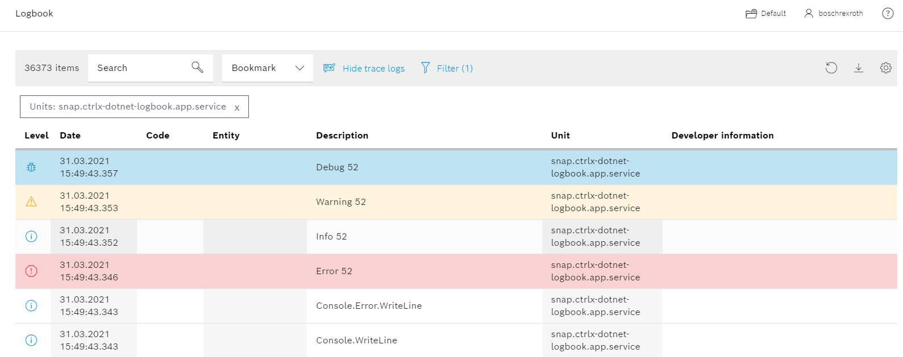

# README .NET diagnostics.logbook

This .NET sample is logging messages to the logbook of ctrlX.

## Introduction

The project __diagnostics.logbook__ provides a simple application example to log messages to the logbook of ctrlX.  

## Description

The following code shows the main method with inline documentation:

[Program.cs](https://github.com/boschrexroth/ctrlx-automation-sdk/blob/develop/samples-net/diagnostics.logbook/Program.cs)

The class KernelLogger writes kernel log messages with the linux command 'logger':
The enum KernelLogLevel defines the log levels supported by the logbook:

[KernelLogger.cs](https://github.com/boschrexroth/ctrlx-automation-sdk/blob/develop/samples-net/diagnostics.logbook/KernelLogger.cs)

## Prerequisites

Please read the common .NET docs [here](./../README.md), first.

## Getting Started

1. Launch VSCode
2. Click on the __Remote Explorer__ from the menu.
3. Choose __Open Folder in WSL__.
4. Open the directory __diagnostics.logbook__.
5. Build and install snap as described [here](./../README.md).
6. Check the output using __Diagnostics__:

   + Login into your ctrlX
   + Navigate to __Diagnostics -> Logbook__ 
   + Click __Settings__ on the right top corner
   + Enable __Show system messages__
   + Navigate to __Filter -> Units__ and check your __snap.ctrlx-dotnet-logbook.app.service__
   + Now you should the see the app output diagnostics. 
   + Press __Refresh__ to update.

8. If you have root permissions, you can also watch the output on any ssh console with the command:
   ```bash
   sudo snap logs ctrlx-dotnet-logbook.app -f | more
   
 ## Screenshot



## Install the App

Login into ctrlX and install the App (Apps).

## Gratulations - We're finished - Let's start coding!


## Support
### Developer Community

Please join the [Developer Community](https://developer.community.boschrexroth.com/)

### SDK Forum

Please visit the [SDK Forum](https://developer.community.boschrexroth.com/t5/ctrlX-AUTOMATION/ct-p/dcdev_community-bunit-dcae/)

### Issues

If you've found an error in these sample, please [file an issue](https://github.com/boschrexroth)

## License

MIT License

Copyright (c) 2021 Bosch Rexroth AG

Permission is hereby granted, free of charge, to any person obtaining a copy
of this software and associated documentation files (the "Software"), to deal
in the Software without restriction, including without limitation the rights
to use, copy, modify, merge, publish, distribute, sublicense, and/or sell
copies of the Software, and to permit persons to whom the Software is
furnished to do so, subject to the following conditions:

The above copyright notice and this permission notice shall be included in all
copies or substantial portions of the Software.

THE SOFTWARE IS PROVIDED "AS IS", WITHOUT WARRANTY OF ANY KIND, EXPRESS OR
IMPLIED, INCLUDING BUT NOT LIMITED TO THE WARRANTIES OF MERCHANTABILITY,
FITNESS FOR A PARTICULAR PURPOSE AND NONINFRINGEMENT. IN NO EVENT SHALL THE
AUTHORS OR COPYRIGHT HOLDERS BE LIABLE FOR ANY CLAIM, DAMAGES OR OTHER
LIABILITY, WHETHER IN AN ACTION OF CONTRACT, TORT OR OTHERWISE, ARISING FROM,
OUT OF OR IN CONNECTION WITH THE SOFTWARE OR THE USE OR OTHER DEALINGS IN THE
SOFTWARE.
