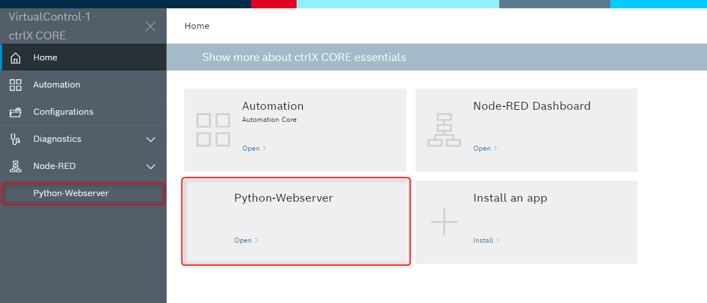
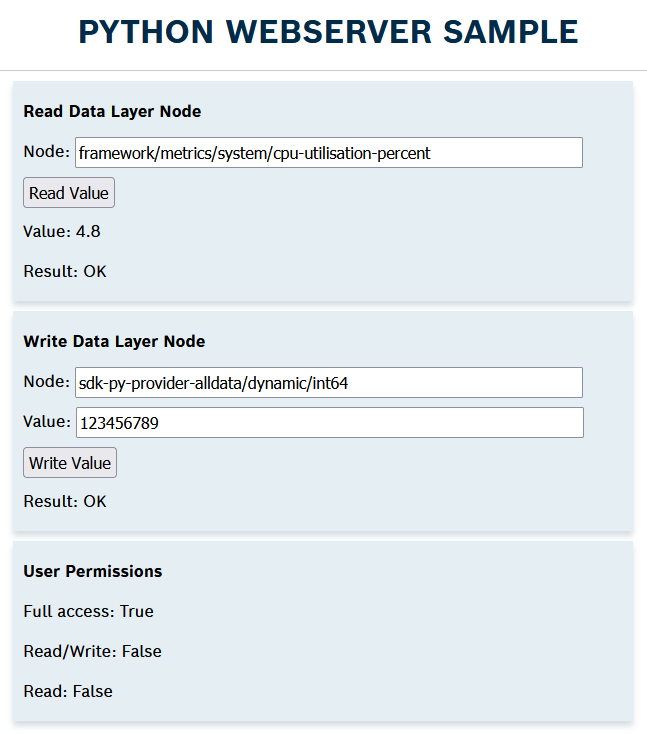
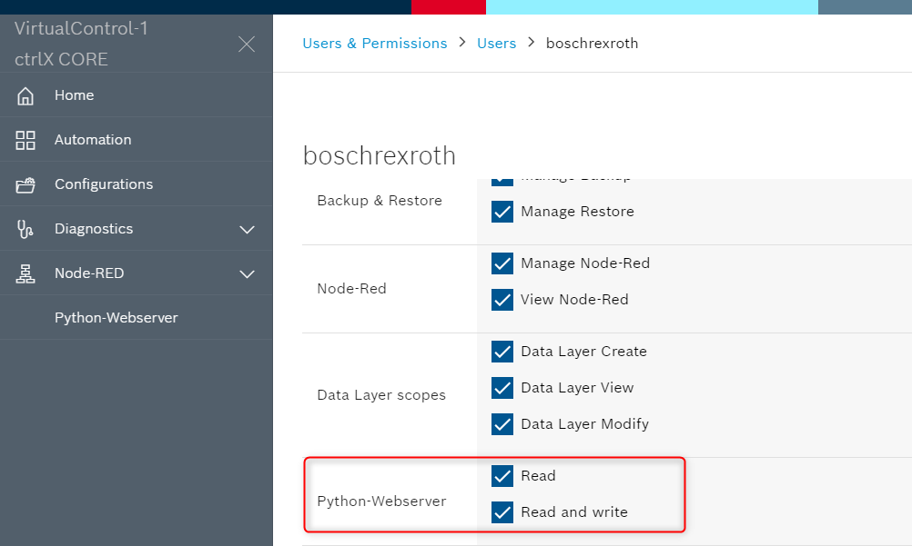

# ctrlX Data Layer + Webserver

## Introduction

This python app deploys a simple webserver including ctrlX Data Layer connection and user permissions with web interface accessible from ctrlX webpage.

## Function Description

The app runs a simple webserver with reverse proxy and ctrlX Data Layer access, setup user permissions through package-manifest and token authentification.

Once the installation of the snap was finished, you can access to the provided webpage through the sidebar or overview menu of the ctrlX CORE webpage.

The Python-Webpage allows you to read and write at the ctrlX Data Layer (depends on permissions of the current user) and shows permissions of the current user. 

You can find the configuration of user permissions (scopes) on the ctrlX at  <ins>Settings > Users & Permissions > Users</ins>

The integration of the app inside ctrlX Core webpage (sidebar and overview integration, reverse proxy, bearertoken, scopes) is done by the package-manifest (<ins>./configs/package-assets/rexroth-python-webserver.package-manifest.json</ins>). 

## Implementation Description

The app has these modules:

* __main.py__ connects to the ctrlX Data Layer and starts the web server. In snap environment an Unix socket connection is established otherwise a TCP/IP connection.

* __app/__
* __datalayer.py__ handles the ctrlX Data Layer node data access.
* __ctrlx_datalayer_helper.py__ handles the ctrlX Data Layer client connection.

* __web/__
* __unix_socket_server.py *)__ Web server class (wrapper) to use unix sockets instead of TCP/IP
* __request_handler.py *)__ Request handler class for both UNIX sockets and TCP/IP
* __web_token.py__  contains a helper function to check permissions using jwt
* __www/__
* __favicon.png__ Favicon for the web site.
* __index.html__ The web site.
* __invalid-token.html__ The web content which is send when the token was wrong.
* __stylesheet.css__ Defines the style of the web site.

___

## License

SPDX-FileCopyrightText: Bosch Rexroth AG
SPDX-License-Identifier: MIT
